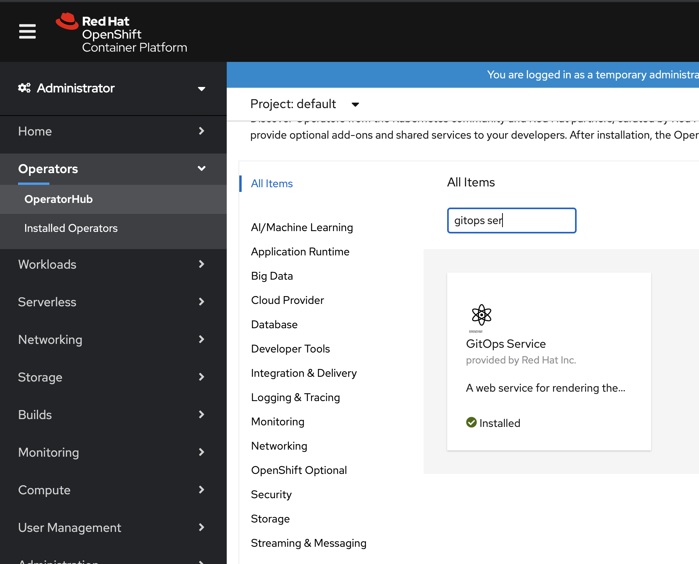

# OpenShift GitOps  Operator

An operator that gets you an Argo CD for cluster configuration out-of-the-box on OpenShift along with the UI for visualizing environments.

# Getting started

## Making the operator available on the in-cluster OperatorHub

1. Add the following resource to your cluster:

```
apiVersion: operators.coreos.com/v1alpha1
kind: CatalogSource
metadata:
  name: gitops-service-source
  namespace: openshift-marketplace
spec:
  displayName: 'Gitops Service by Red Hat'
  image: 'quay.io/<quay-username>/gitops-operator-index:v0.0.1'
  publisher: 'Red Hat Developer'
  sourceType: grpc
```

2. Go to the OperatorHub on OpenShift Webconsole and look for the "OpenShift GitOps" operator.




3. Install the operator in the `openshift-gitops-operator` namesapce using the defaults in the wizard, and optionally, select the checkbox to enable cluster monitoring on the namesapce. Wait for it to show up in the list of "Installed Operators". If it doesn't install properly, you can check on its status in the "Installed Operators" tab in the `openshift-gitops-operator` namespace.


4. To validate if the installation was successful, look for the route named `cluster` in the `openshift-gitops` namespace. Note: the namespace doesn't have to exist in advance, the operator creates it for you.

That's it! Your API `route` should be created for you. You don't need to expliclty create any operand/CR.

## Contributing


1. Clone the repository.
2. Login to a cluster on your command-line.
3. Execute `make install` to apply the CRDs.
4. Execute `make run` to run the operator locally.

## Tests

#### Unit tests

```
make test
```

#### e2e tests

```
make test-e2e
```

## Re-build and Deploy

This operator currently deploys the following payload:

```
quay.io/<quay-username>/gitops-backend:v0.0.1
```

If that's all that you are changing, the following steps are not needed in development
mode. You could update your image "payload" and re-install the operator.

Set the base image and version for building operator, bundle and index images.

```
export IMAGE=quay.io/<quay-username>/gitops-operator VERSION=1.8.0
```

1. Build and push the operator image.

```
make docker-build docker-push
```


2. Build and push the Bundle image ( operator + OLM manifests )

```
make bundle
make bundle-build bundle-push
```

3. Build and push the Index image

Install `opm` binary which is required to build index images

```
make opm
```

```
make catalog-build catalog-push
```

The Index image powers the listing of the Operator on OperatorHub.


## GitOps Operator vs [Argo CD Community Operator](https://github.com/argoproj-labs/argocd-operator)

| Features | GitOps Operator | Argo CD Community Operator |
| -------- | -------- | -------- |
| Default Cluster Argo CD instance | ✅ | ❌ |
| Cluster  Argo CD instances in namespaces defined by envrionment variable ARGOCD_CLUSTER_CONFIG_NAMESPACES | openshift-gitops| ❌ |
| Cluster Configuration RBAC/Policy Rules | All APIGroups,Resources,`get`,`list`,`watch` Verbs appended with `admin` ClusterRoles. Additional APIGroups: `operator.openshift.io`,`user.openshift.io`, `config.openshift.io`, `console.openshift.io`, `machine.openshift.io`, `machineconfig.openshift.io`, `compliance.openshift.io`, `rbac.authorization.k8s.io`, `storage.k8s.io`, etc. | All APIGroups,Resources,Verbs
| Integrated with OpenShift Console Environments page for visualizing GitOps environments and applications | ✅ | ❌ |
| Air-gapped environments | OCP | ❌ |
| Installed tools | helm 3, kustomize | helm 2 and 3, kustomize, ksonnet |
| Single Sign-on | RHSSO, Dex | Keycloak, Dex |
| Redis Server | Redis 5, Secure connection is not yet supported | Redis 6 |
| ArgoCDExport | ❌ | ✅ |
| Installation Modes | All Namepaces | Single, All Namespaces |
| Support for Kubernetes | ❌ | ✅ |
| Maintained by | Red Hat | Community  |

## Migrate from [Argo CD Community Operator](https://github.com/argoproj-labs/argocd-operator) to GitOps Operator

Please follow the steps mentioned in the doc to migrate from [Argo CD Community Operator](https://github.com/argoproj-labs/argocd-operator) to GitOps Operator.

## Progressive Delivery

OpenShift GitOps from release v1.9.0 supports progressive delivery using [Argo Rollouts](https://argo-rollouts.readthedocs.io/en/stable/).

Users can enable progressive delivery by using a new type of CRD called `RolloutManager`. A detailed usage guide for this new CRD is available [here](https://argo-rollouts-manager.readthedocs.io/en/latest/crd_reference/).


