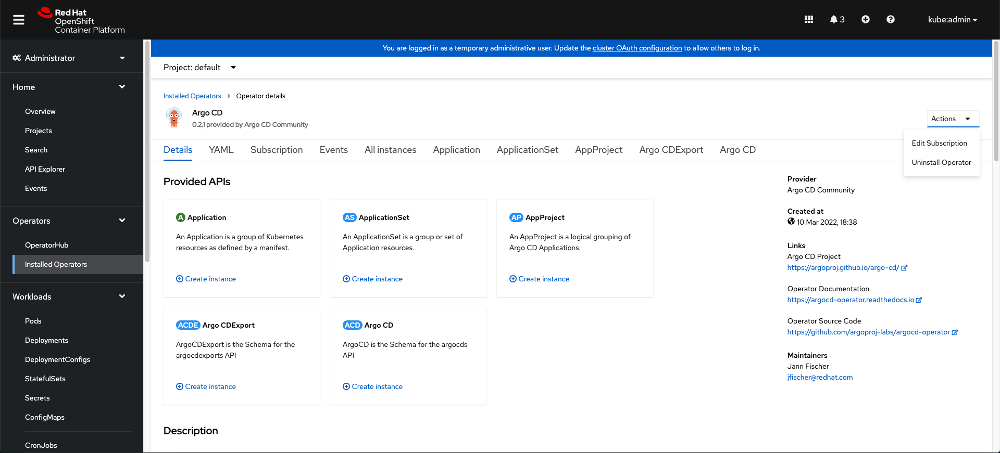
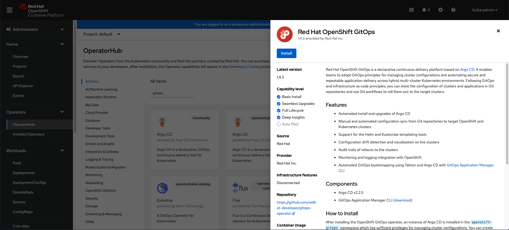

# Migrate from [Argo CD Community Operator](https://github.com/argoproj-labs/argocd-operator) to GitOps Operator

This document provides the required guidance and steps to follow to migrate from [Argo CD Community Operator](https://github.com/argoproj-labs/argocd-operator) to GitOps Operator.

For understanding the differences between [Argo CD Community Operator](https://github.com/argoproj-labs/argocd-operator) to GitOps Operator, kindly refer to the [README](https://github.com/redhat-developer/gitops-operator/blob/master/README.md#gitops-operator-vs-argo-cd-community-operator) file of the repository.

**Note**: Installing GitOps operator on OpenShift will create a namespace with the name `openshift-gitops` and an Argo CD instance in the same namespace. This instance can be used for managing your OpenShift cluster configuration. It is enabled with Dex OpenShift connector by default which allows users to log in with their OpenShift credentials. On Non-OpenShift cluster no default argocd instance is created.

The default Argo CD instance in the `openshift-gitops` namespace can be deleted by adding an environmental variable `DISABLE_DEFAULT_ARGOCD_INSTANCE` with the value `true` in the Subscription resource. With this set, the `openshift-gitops` namespace is not created. If it already exists, the operator deletes the resources it created there, but leaves the namespace itself in place, since it may hold resources you created yourself, cleaning those up and removing the namespace is up to you.

To disable the default instance, edit the Subscription and add the following:

```yaml
spec:
  config:
    env:
      - name: DISABLE_DEFAULT_ARGOCD_INSTANCE
        value: 'true'
```

## Which GitOps Operator version should I migrate to ?

Please refer to the below table to understand the correct version of GitOps operator that you need to migrate from the community operator.

| GitOps Operator | Argo CD Operator | Default Argo CD Version |
| -------- | -------- | -------- |
| v1.20.z | v0.18.z | v3.3.z |
| v1.19.z | v0.17.z | v3.1.z |
| v1.18.z | v0.16.z | v3.1.z |
| v1.17.z | v0.15.z | v3.0.z |
| v1.16.z | v0.14.z | v2.14.z |
| v1.15.z | v0.13.z | v2.13.z |

**Note:** For exact component versions, see the [Red Hat OpenShift GitOps release notes](https://docs.redhat.com/en/documentation/red_hat_openshift_gitops/).

## Migration

### Copy any environment variables added to the Subscription resource

Any environment variables added to the subscription resource of Argo CD operator has to be added back to the subscription resource of GitOps Operator post migration.

To get the list of environment variables added to the subscription resource,

In the RedHat OpenShift platform, go to the `Operators` section (located on the left side of the toolbar).

- Go to the `Installed Operators` section, where one can view all the installed operators for the particular cluster.
- Select Argo CD, click on the `Subscription` Tab, go to Actions (located on the top right corner), click on `Edit Subscription`.
- List of environment variables can be found under `.spec.config`.

An example subscription resource that is configured with environment variables to enable custom cluster roles is shown below.

```yaml
apiVersion: operators.coreos.com/v1alpha1
kind: Subscription
metadata:
  name: argocd-operator
  namespace: argocd
spec:
  config:
    env:
    - name: CONTROLLER_CLUSTER_ROLE
      value: custom-controller-role
    - name: SERVER_CLUSTER_ROLE
      value: custom-server-role
```

Post migration the above environment variables has to be copied to GitOps operator subscription resource.

**Note**:
GitOps operator supports additional environment variables beyond those recognized by the Argo CD Community Operator, such as
`DISABLE_DEFAULT_ARGOCD_INSTANCE` and `ARGOCD_CLUSTER_CONFIG_NAMESPACES`. For the full list with default values and descriptions,
see [Setting environment variables](./OpenShift%20GitOps%20Usage%20Guide.md#setting-environment-variables) in the OpenShift GitOps
Usage Guide.

### Uninstall Argo CD Operator

In the RedHat OpenShift platform, go to the `Operators` section (located on the left side of the toolbar).

- Go to the `Installed Operators` section, where one can view all the installed operators for the particular cluster.
- Select Argo CD, go to Actions (located on the top right corner), and finally select Uninstall Operator.



**Note:** OLM does not delete any Argo CD instances, Applications or workloads created by this operator.

### Install GitOps Operator

-> Go to Operators -> OperatorHub -> Red Hat OpenShift GitOps -> Install



All the workloads, applications and resources created by the Argo CD Operator are preserved. OLM does not remove any configuration
created by the Argo CD Operator. You can login into the GitOPs operator with the same user credentials that were used to log into Argo CD
Operator.

**Note:**
GitOps operator is a Red Hat provider operator. Post installation, it updates the workloads (controller, repo-server, server, etc.) to Red Hat UBI-based container images from `registry.redhat.io`.

**Important**: The community operator images are Ubuntu-based, while GitOps operator uses UBI (Universal Base Image) based images. These images are **incompatible**. If you have configured the Argo CD custom resource with `.spec.image` and `.spec.version` fields to pin custom images, you should either:

1. Remove those fields to use the default UBI-based images provided by the GitOps operator, or
2. Build your own custom images based on UBI.

Continuing to use Ubuntu-based images with the GitOps operator is not recommended for the following reasons:

1. They are not supported by Red Hat.
2. GitOps operator fails to install in Disconnected or Air-gapped clusters.

**Note:**
On non-OpenShift clusters, OpenShift GitOps does not support the `GitopsService` custom resource, Dex OpenShift OAuth, the default Argo CD instance, or OpenShift Routes.