# OpenShift GitOps Usage Guide

## Table of Contents
1. [Installing OpenShift GitOps](#installing-openshift-gitops)  
2. [Configure RHSSO for OpenShift GitOps(>= v1.2)](#configure-rhsso-for-openshift-gitops-v12)  
3. [Setting up OpenShift Login (=< v1.1.2)](#setting-up-openshift-login--v112)
4. [Setting environment variables](#setting-environment-variables)    
5. [Configuring the groups claim](#configuring-the-groups-claim-)  
6. [Getting started with GitOps Application Manager (kam)](#getting-started-with-gitops-application-manager-kam)  
7. [Setting up a new ArgoCD instance](#setting-up-a-new-argo-cd-instance)  
8. [Configure resource quota/requests for OpenShift GitOps workloads](#configure-resource-quotarequests-for-openshift-gitops-workloads)  
9. [Running default Gitops workloads on Infrastructure Nodes](#running-default-gitops-workloads-on-infrastructure-nodes)  
10. [Using NodeSelector and Tolerations in Default Instance of Openshift GitOps](#using-nodeselector-and-tolerations-in-default-instance-of-openshift-gitops)
11. [Monitoring](#monitoring)  
12. [Logging](#logging)  
13. [Prevent auto-reboot during Argo CD sync with machine configs](#prevent-auto-reboot-during-argo-cd-sync-with-machine-configs)  
14. [Machine configs and Argo CD: Performance challenges](#machine-configs-and-argo-cd-performance-challenges)  
15. [Health status of OpenShift resources](#health-status-of-openshift-resources)  
16. [Upgrade GitOps Operator from v1.0.1 to v1.1.0 (GA)](#upgrade-gitops-operator-from-v101-to-v110-ga)  
17. [Upgrade GitOps Operator from v1.1.2 to v1.2.0 (GA)](#upgrade-gitops-operator-from-v112-to-v120-ga) 
18. [GitOps Monitoring Dashboards](#gitops-monitoring-dashboards) 

## Installing OpenShift GitOps

### Operator Install GUI

To install OpenShift GitOps, find the OpenShift GitOps Operator in OperatorHub by typing "gitops" in the search box and click on the OpenShift GitOps Operator.

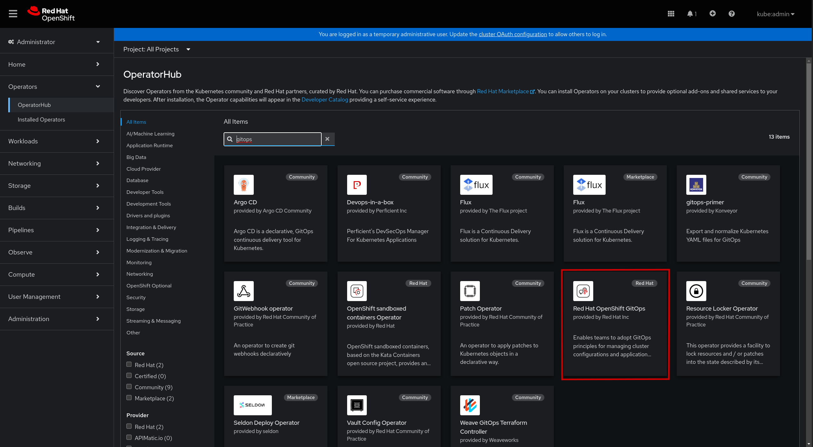

The Operator UI guides you through to install the OpenShift GitOps Operator.  You can go ahead with the default installation options (this operator installs to all namespaces on the cluster).

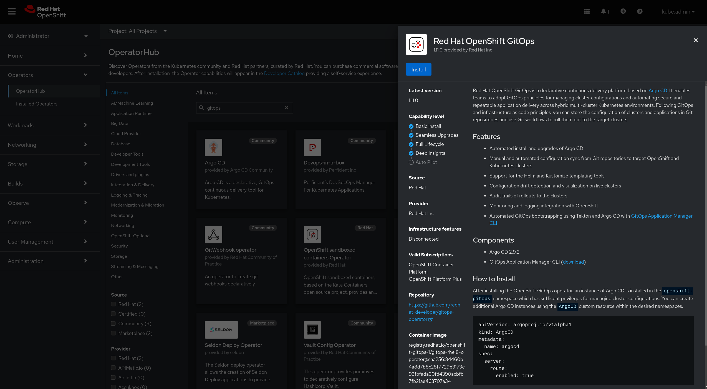

Click the "Install" button to finish the installation.

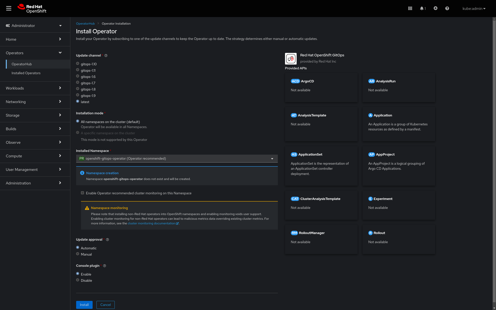

* * *


### Operator Install CLI

To install the Operator via the CLI, you will need to create a Subscription.

```
apiVersion: operators.coreos.com/v1alpha1
kind: Subscription
metadata:
  name: openshift-gitops-operator
  namespace: openshift-gitops-operator
spec:
  channel: stable
  installPlanApproval: Automatic
  name: openshift-gitops-operator
  source: redhat-operators
  sourceNamespace: openshift-marketplace
  ```


Then, you apply this to the cluster.

`$ oc apply -f openshift-gitops-sub.yaml`

After a while (about 1-2 minutes), you should see the following Pods appear.

```
$ oc get pods -n openshift-gitops
NAME                                                      	READY   STATUS	RESTARTS   AGE
cluster-b5798d6f9-zr576                                   	1/1 	Running   0      	65m
kam-69866d7c48-8nsjv                                      	1/1 	Running   0      	65m
openshift-gitops-application-controller-0                 	1/1 	Running   0      	53m
openshift-gitops-applicationset-controller-6447b8dfdd-5ckgh 1/1 	Running   0      	65m
openshift-gitops-redis-74bd8d7d96-49bjf                   	1/1 	Running   0      	65m
openshift-gitops-repo-server-c999f75d5-l4rsg              	1/1 	Running   0      	65m
openshift-gitops-server-5785f7668b-wj57t                  	1/1 	Running   0      	53m
```

### Installation of OpenShift GitOps without ready-to-use Argo CD instance, for ROSA/OSD

When installing the OpenShift GitOps operator to ROSA/OSD, cluster administrators may wish to exclude users from modifying resources within the *openshift-** namespaces, including the *openshift-gitops* namespace which is the default location for an Argo CD install.

To disable the default ‘ready-to-use’ installation of Argo CD: as an admin, update the existing Subscription Object for Gitops Operator and add `DISABLE_DEFAULT_ARGOCD_INSTANCE = true` to the spec.

**Warning**: setting this option to true will cause the existing Argo CD install in the *openshift-gitops* namespace to be deleted. Argo CD instances in other namespaces should not be affected.

   On OpenShift Console, go to 

    * **Administration -> CustomResourceDefinition -> Subscription -> Instances** and select **"openshift-gitops-operator**"

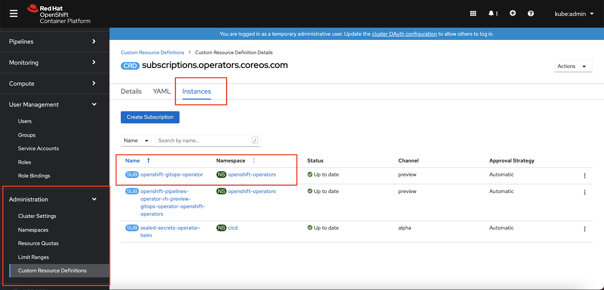


Select the **YAML** tab and edit the Subscription

A ready-to-use Argo CD instance is created by GitOps Operator in the *openshift-gitops* namespace.   The instance name is also *openshift-gitops*.

### Logging in to the ready-to-use Argo CD


You can launch into this Argo CD instance from the Console Application Launcher.

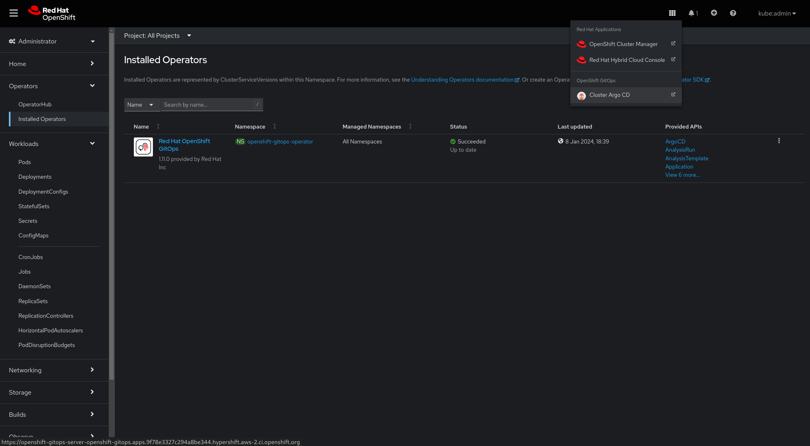

**Note: To disable the Link to Argo CD in the Console Application Launcher, see the documentation on how to disable consoleLink in the [setting environment variables section](#setting-environment-variables)**

Alternatively, the DNS hostname of the Argo CD Web Console can be retrieved by the command line.  

`oc get route openshift-gitops-server -n openshift-gitops -o jsonpath='{.spec.host}'`


The output of the command (e.g. openshift-gitops-server-openshift-gitops.apps.gitops1.devcluster.openshift.com) can be pasted to the address bar of a web browser.   The web browser will open the login page of the Argo CD instance.

For the pre-created Argo CD instance under **_openshift-gitops_** project, you’ll find the password here:

* Navigate to the "openshift-gitops" project

* Go to "Secrets" tab and find the secret \<argocd-instance-name\>-cluster.   *openshift-gitops-cluster *in this case for the pre-created Argo CD instance.


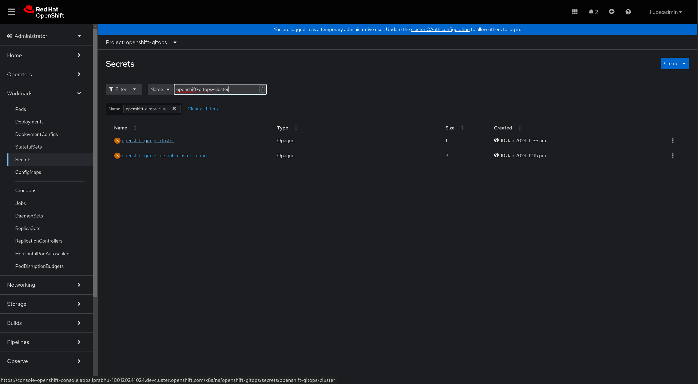

* Copy the password to the clipboard


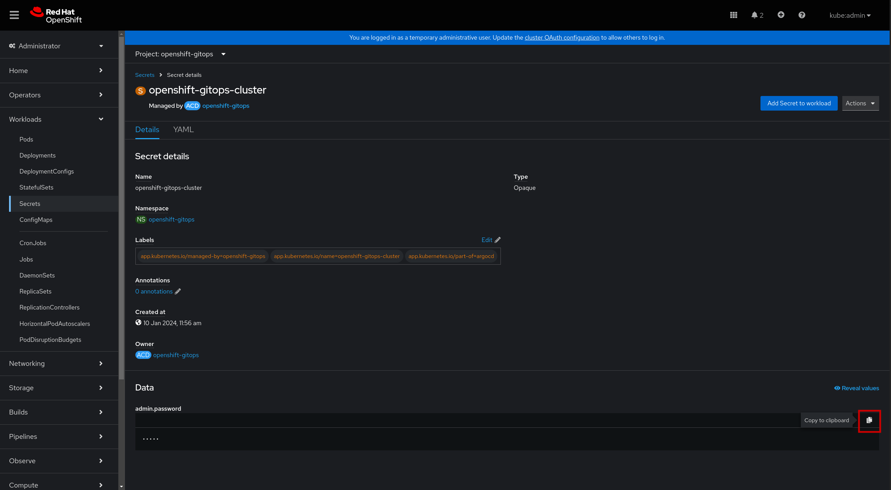

Alternatively, you may fetch the Argo CD instance’s  admin password running the command line.

`oc get secret/openshift-gitops-cluster -n openshift-gitops -o jsonpath='{.data.admin\.password}' | base64 -d`

And now you can log in to the Argo CD UI as *admin* using the retrieved password.

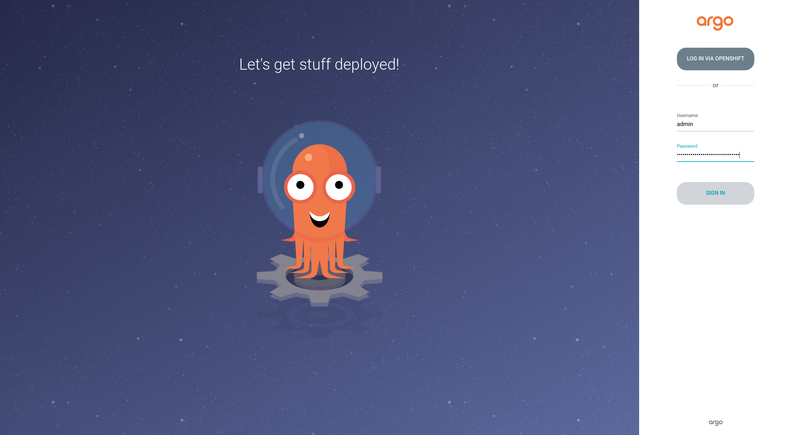

### Create an Argo CD Application

Now, you can create an Argo CD application and let Argo CD keep application resources live states in sync with the configuration in Git.   

[https://github.com/siamaksade/openshift-gitops-getting-started](https://github.com/siamaksade/openshift-gitops-getting-started)

## Configure RHSSO for OpenShift GitOps(**>= v1.2**)

**Scope:**

The scope of this section is to describe the steps to Install, Configure(**Setup Login with OpenShift**) and Uninstall the RHSSO with OpenShift GitOps operator v1.2.

### **Install**

**Prerequisite:**

**NOTE:** `DISABLE_DEX` environment variable is no longer supported in OpenShift GitOps v1.10 onwards. Dex can be enabled/disabled using `.spec.sso.provider`. 

Make sure you disable dex 

`oc -n <namespace> patch argocd <argocd-instance-name> --type='json' -p='[{"op": "remove", "path": "/spec/sso"}]'`

User/Admin needs to patch the Argo CD instance/s with the below command.

`oc -n <namespace> patch argocd <argocd-instance-name> --type='json' -p='[{"op": "add", "path": "/spec/sso", "value": {"provider": "keycloak"} }]'`

Below `oc` command can be used to patch the default Argo CD Instance in the openshift-gitops namespace. 

`oc -n openshift-gitops patch argocd openshift-gitops --type='json' -p='[{"op": "add", "path": "/spec/sso", "value": {"provider": "keycloak"} }]'`

**Note: Make sure the keycloak pods are up and running and the available replica count is 1. It usually takes 2-3 minutes.**

#### **Additional Steps for Disconnected OpenShift Clusters**

Skip this step for regular OCP and OSD clusters.

In a [disconnected](https://access.redhat.com/documentation/en-us/red_hat_openshift_container_storage/4.7/html/planning_your_deployment/disconnected-environment_rhocs) cluster, Keycloak communicates with OpenShift Oauth Server through proxy. Below are some additional steps that need to be followed to get Keycloak integrated with OpenShift Oauth Login.

##### **Login to the Keycloak Pod**

`oc exec -it dc/keycloak -n <namespace> -- /bin/bash`


##### **Run JBoss Cli command**

`/opt/eap/bin/jboss-cli.sh`


##### **Start an Embedded Standalone Server**

`embed-server --server-config=standalone-openshift.xml`


##### **Run the below commands to setup proxy mappings for OpenShift OAuth Server**

**Get OAuth Server Host.  <oauth-server-host>**

`oc get routes oauth-openshift -n openshift-authentication -o jsonpath='{.spec.host}’`

**Get Proxy Server Host (and port).  <proxy-server-host>**

`oc get proxy cluster -o jsonpath='{.spec.httpProxy}'`


**Replace the <oauth-server-host> and <proxy-server-host> Server details in the below command and run to setup Proxy mappings.**

`/subsystem=keycloak-server/spi=connectionsHttpClient/provider=default:write-attribute(name=properties.proxy-mappings,value=["<oauth-server-host>;<proxy-server-host>"])`


##### **Stop the Embedded Server**

`quit`


##### **Reload JBoss**

`/opt/eap/bin/jboss-cli.sh --connect --command=:reload`


Exit oc remote shell to keycloak pod

`exit`

### **Login with OpenShift**

Go to the OpenShift Console -> Networking -> Routes 

Click on the \<argocd-instance\>-server route url to access the Argo CD UI.

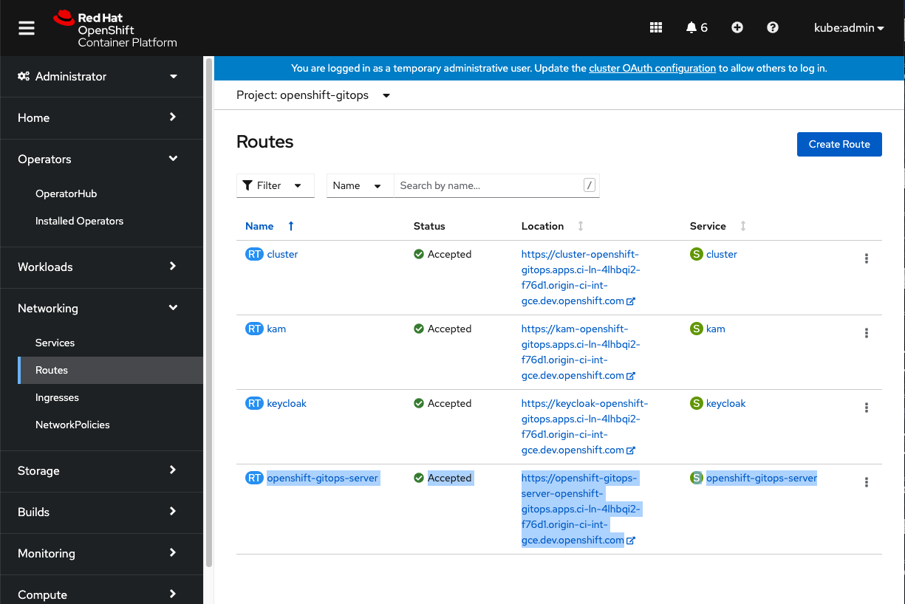

You will be redirected to Argo CD Login Page.

You can see an option to **LOG IN VIA KEYCLOAK** apart from the usual Argo CD login. Click on the button. (Please choose a different browser or incognito window to avoid caching issues).

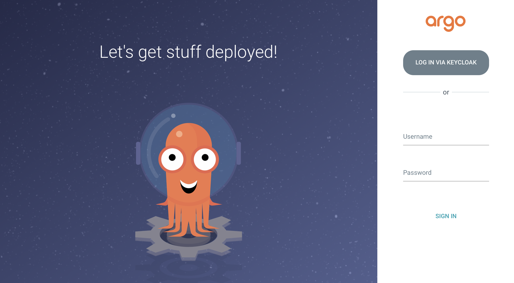

You will be redirected to a new page which provides you an option to **Login with OpenShift.**Click on the button to get redirected to the OpenShift Login Page.

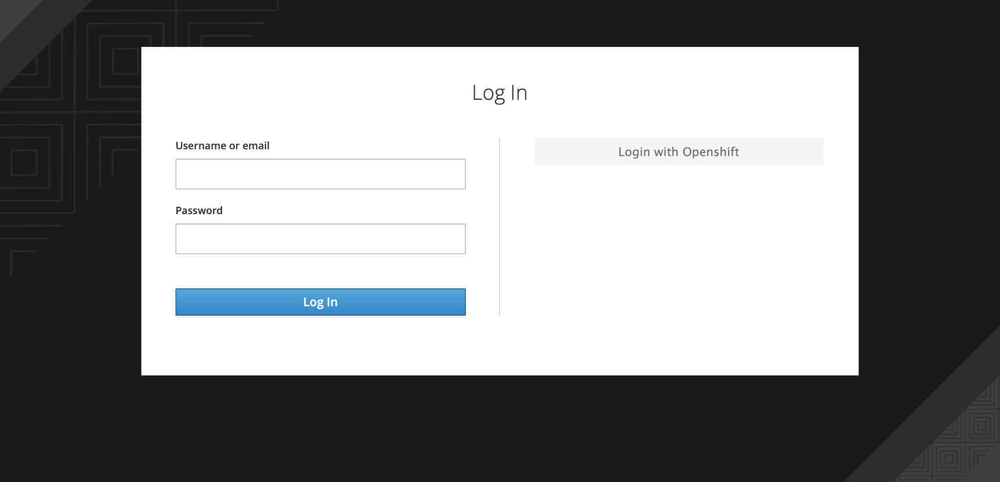

### 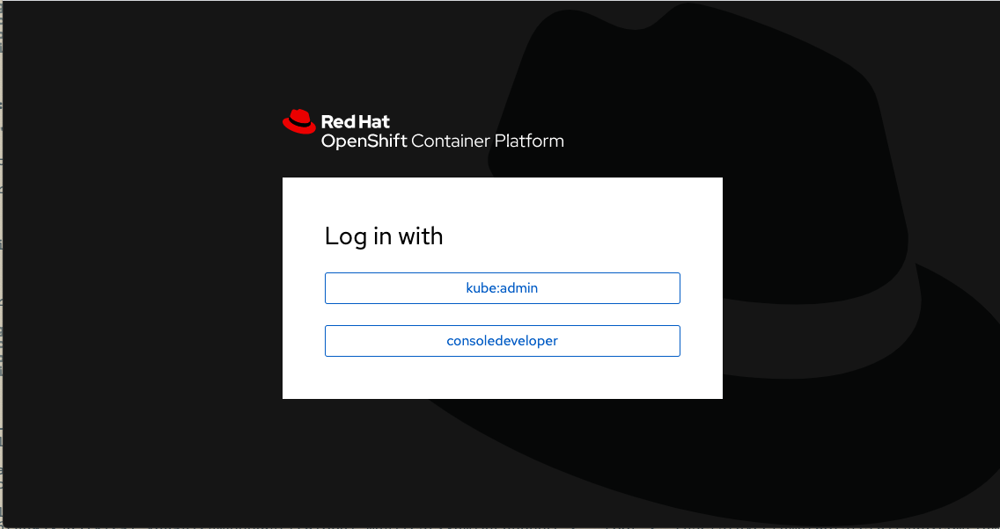

Provide the OpenShift login credentials to get redirected to Argo CD. You can look at the user details by clicking on the User Information Tab as shown below.

<table>
  <tr>
    <td><span>Note</span>: Keycloak does not allow Login with the "kube:admin" user. Please choose a different user. 

The OpenShift-v4 Keycloak identity provider requires a non-null uid in order to be able to link the OpenShift user to the Keycloak user. Incase of user kubeadmin the user profile metadata does not contain such a UID.

References:\
https://github.com/eclipse/che/issues/16835 \
https://github.com/openshift/origin/issues/24950

As an option, You can configure an htpasswd Identity Provider using this [link](https://docs.openshift.com/container-platform/4.7/authentication/identity_providers/configuring-htpasswd-identity-provider.html).</td>
  </tr>
</table>


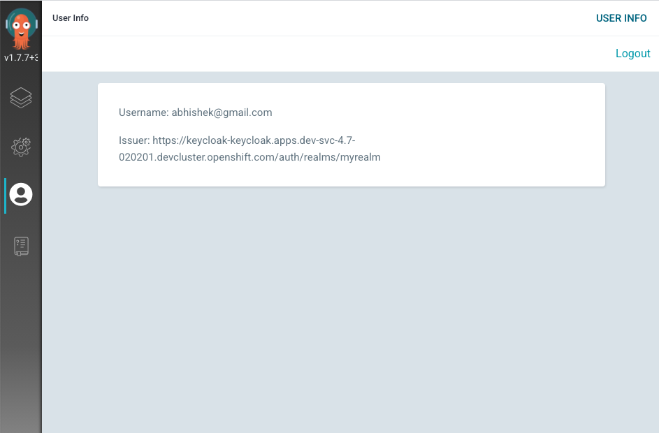

### **Configure Argo CD RBAC**


For versions upto and not including v1.10, any user logged into Argo CD using RHSSO will be a read-only user by default.

`policy.default: role:readonly`

For versions starting v1.10 and above,

- any user logged into the default Argo CD instance `openshift-gitops` in namespace `openshift-gitops` will have no access by default.

`policy.default: ''`

- any user logged into user managed custom Argo CD instance will have `read-only` access by default.

`policy.default: 'role:readonly'`


This behavior can be modified by updating the *argocd-rbac-cm*  configmap data section.

`oc edit cm argocd-rbac-cm -n x`


```
metadata
...
...
data:
  policy.default: role:readonly
```


You can also do this via a patch

`oc patch cm/argocd-rbac-cm -n openshift-gitops --type=merge -p '{"data":{"policy.default":"role:admin"}}'`

**User Level Access**

Admin needs to configure the Argo CD RBAC configmap to manage user level access.

Adding the below configuration(policy.csv) to *Argo CD-rbac-cm*  configmap data section will grant **Admin** access to a user **foo** with email-id **foo@example.com**

`oc edit cm argocd-rbac-cm -n <namespace>`

```
metadata
...
...
data:
  policy.default: role:readonly
  policy.csv: |
    g, foo@example.com, role:admin
```

A detailed information on configuring RBAC to your Argo CD instances is provided [here](https://argo-cd.readthedocs.io/en/stable/operator-manual/rbac/).

**Group Level Access:**

**Note**: Currently, RHSSO cannot read the group information of OpenShift users. So, RBAC must be configured at the user level.

### **Modify RHSSO Resource requests/limits**

RHSSO container by default gets created with default resource requests and limits as shown below.

**Default RHSSO Resource Requirements**

<table>
  <tr>
    <td>Resource</td>
    <td>Requests</td>
    <td>Limits</td>
  </tr>
  <tr>
    <td>CPU</td>
    <td>500m</td>
    <td>1000m</td>
  </tr>
  <tr>
    <td>Memory</td>
    <td>512 Mi</td>
    <td>1024 Mi</td>
  </tr>
</table>


Users can modify the default resource requirements by patching the Argo CD CR as shown below. 

`oc -n openshift-gitops patch argocd openshift-gitops --type='json' -p='[{"op": "add", "path": "/spec/sso", "value": {"provider": "keycloak", "keycloak": {"resources": {"requests": {"cpu": "512m", "memory": "512Mi"}, "limits": {"cpu": "1024m", "memory": "1024Mi"}}} }}]'`


### **Persistence**

The main purpose of RHSSO created by the operator is to allow users to login into Argo CD with their OpenShift users. It is not expected and not supported to update and use this RHSSO instance for any other use-cases.

**Note**: RHSSO created by this feature **only persists the changes that are made by the operator**. Incase of RHSSO restarts, any additional configuration created by the Admin in RHSSO will be deleted. 

### **Uninstall** 

You can delete RHSSO and its relevant configuration by removing the SSO field from Argo CD Custom Resource Spec.

`oc -n <namespace> patch argocd <argocd-instance-name> --type json   -p='[{"op": "remove", "path": "/spec/sso"}]'`

Below `oc` command can be used to patch the default Argo CD Instance in the openshift-gitops namespace. 

`oc -n openshift-gitops patch argocd openshift-gitops --type json   -p='[{"op": "remove", "path": "/spec/sso"}]'`


Or you can manually remove the **.spec.sso** field from the Argo CD Instance.

**NOTE:** `.spec.sso.image`, `.spec.sso.version`, `.spec.sso.resources` and `.spec.sso.verifyTLS` are no longer supported in OpenShift GitOps v1.10 onwards. Keycloak can be configured using `.spec.sso.keycloak`. 

### **Skip the Keycloak Login page and display the OpenShift Login page.**

#### **Login to RHSSO**

Go to the OpenShift Console -> Networking -> Routes 

Click on the Keycloak route url to access the RHSSO Administrative Console.

Get the Keycloak credentials by running the below command.

`oc -n <namespace> extract secret/keycloak-secret --to=-`


#### **Set OpenShift as a default Identity Provider**

It is possible to automatically redirect to an identity provider instead of displaying the login form. To enable this go to the Authentication page in the administration console and select the Browser flow. Then click on config for the Identity Provider Redirector authenticator. Set Default Identity Provider to the alias of the identity provider you want to automatically redirect users to.

**Identity Providers -> name** to **Authentication(Browser Flow) -> Identity Provider Redirector -> config -> Default Identity Provider**

If the configured default identity provider is not found the login form will be displayed instead.

## Setting up OpenShift Login (**=< v1.1.2**)

You may want to log in to Argo CD using your Openshift Credentials through Keycloak as an Identity Broker by doing the following*.*

### Prerequisites*: *

**[Red Hat SSO](https://access.redhat.com/documentation/en-us/red_hat_single_sign-on/7.4/html/red_hat_single_sign-on_for_openshift_on_openjdk/get_started)** needs to be installed on the cluster.

### Create a new client in Keycloak[¶](https://argoproj.github.io/argo-cd/operator-manual/user-management/keycloak/#creating-a-new-client-in-keycloak)

First we need to set up a new client. Start by logging into your keycloak server, select the realm you want to use (myrealm in this example) and then go to **Clients** and click the **create** button top right.

Add a new client using Client ID as Argo CD, protocol as openid-connect and Root url as the Argo CD route URL. Refer to the Argo CD Installation section under Setting up a new Argo CD Instance.

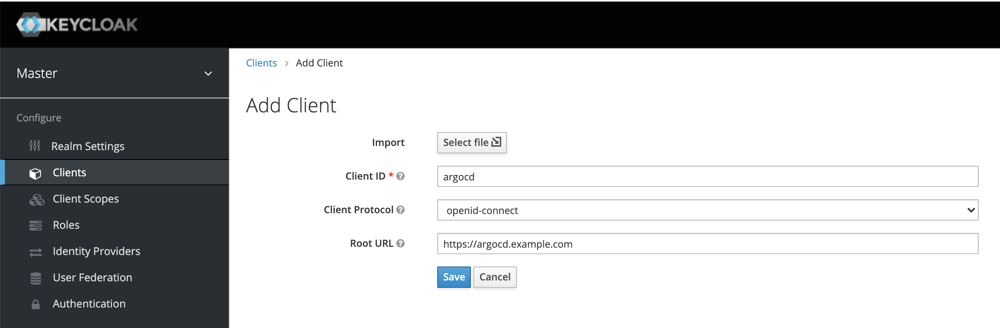

Configure the client by setting the **Access Type** to *confidential* and set the Valid Redirect URIs to the callback url for your Argo CD hostname. It should be https://{hostname}/auth/callback (you can also leave the default less secure https://{hostname}/* ). You can also set the **Base URL** to */applications*.

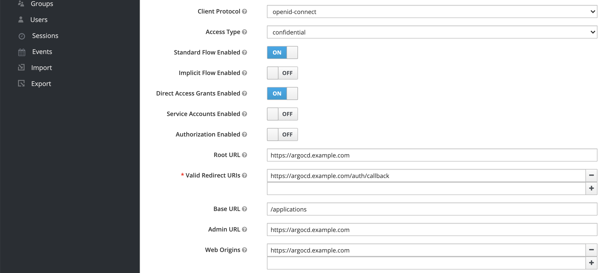

Make sure to click **Save**. You should now have a new tab called **Credentials**. You can copy the Secret that we'll use in our Argo CD configuration.

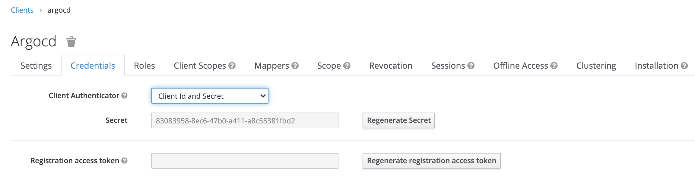

## **Setting environment variables**

Updating the following environment variables in the existing Subscription Object for the GitOps Operator will allow you (as an admin) to change certain properties in your cluster:

<table>
  <tr>
    <td>Environment variable</td>
    <td>Default value</td>
    <td>Description</td>
  </tr>
  <tr>
    <td>ARGOCD_CLUSTER_CONFIG_NAMESPACES</td>
    <td>none</td>
    <td>When provided with a namespace, Argo CD is granted permissions to manage specific cluster-scoped resources which include
    platform operators, optional OLM operators, user management, etc. Argo CD is not granted cluster-admin.</td>
  </tr>
  <tr>
    <td>CONTROLLER_CLUSTER_ROLE</td>
    <td>none</td>
    <td>Administrators can configure a common cluster role for all the managed namespaces in role bindings for the Argo CD application controller with this environment variable. Note: If this environment variable contains custom roles, the Operator doesn't create the default admin role. Instead, it uses the existing custom role for all managed namespaces.</td>
  </tr>
  <tr>
    <td>DISABLE_DEFAULT_ARGOCD_CONSOLELINK</td>
    <td>false</td>
    <td>When set to `true`, will disable the ConsoleLink for Argo CD, which appears as the link to Argo CD in the Application Launcher. This can be beneficial to users of multi-tenant clusters who have multiple instances of Argo CD.</td>
  </tr>
  <tr>
    <td>DISABLE_DEFAULT_ARGOCD_INSTANCE</td>
    <td>false</td>
    <td>When set to `true`, will disable the default 'ready-to-use' installation of Argo CD in `openshift-gitops` namespace.</td>
  </tr>
  <tr>
    <td>SERVER_CLUSTER_ROLE</td>
    <td>none</td>
    <td>Administrators can configure a common cluster role for all the managed namespaces in role bindings for the Argo CD server with this environment variable. Note: If this environment variable contains custom roles, the Operator doesn’t create the default admin role. Instead, it uses the existing custom role for all managed namespaces.</td>
  </tr>
</table>

## **Configuring the groups claim**[ ¶](https://argoproj.github.io/argo-cd/operator-manual/user-management/keycloak/#configuring-the-groups-claim)

In order for Argo CD to provide the groups the user is in we need to configure a groups claim that can be included in the authentication token. To do this we'll start by creating a new **Client Scope** called *groups*.

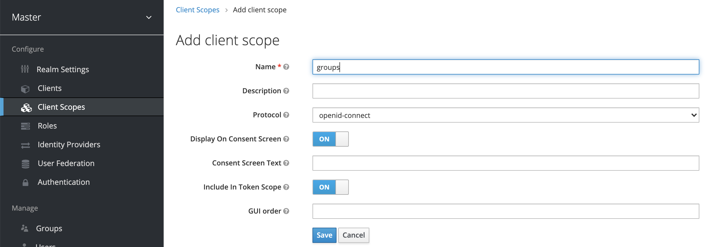

Once you've created the client scope you can now add a Token Mapper which will add the groups claim to the token when the client requests the groups scope. Make sure to set the **Name** as well as the **Token Claim Name** to *groups*.

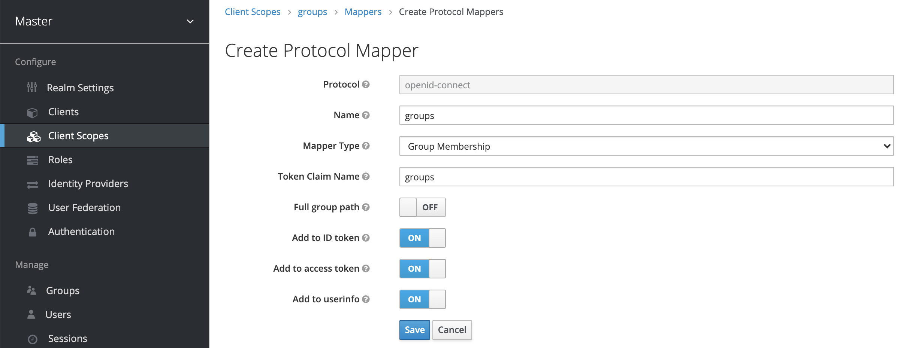

We can now configure the client to provide the *groups* scope. You can now assign the *groups* scope either to the **Assigned Default Client Scopes** or to the **Assigned Optional Client Scopes**. If you put it in the Optional category you will need to make sure that Argo CD requests the scope in it's OIDC configuration.

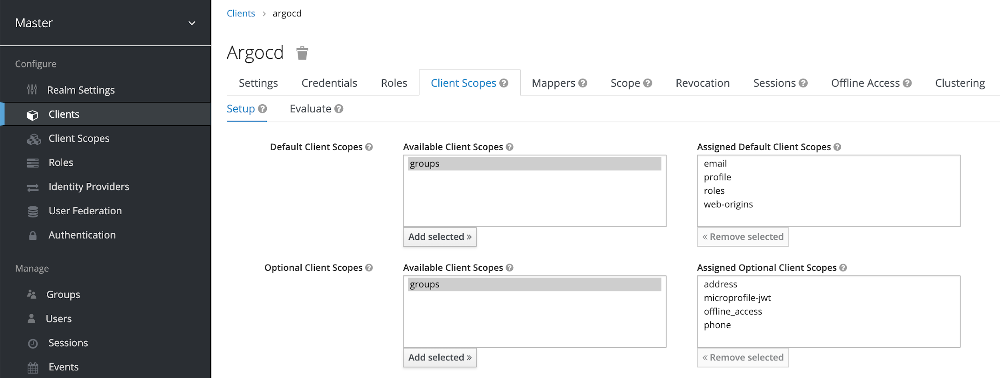

Since we will always want group information, I recommend using the Default category. Make sure you click **Add selected** and that the *groups* claim is in the correct list on the **right**.

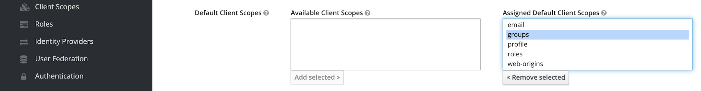

**Create a group called ****_ArgoCDAdmins_****.**

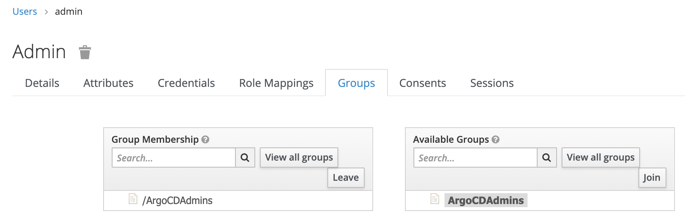

### **Configuring Argo CD OIDC**

Let's start by storing the client secret you generated earlier in the Argo CD secret Argo CD-secret

1. First you'll need to encode the client secret in base64: `$ echo -n '83083958-8ec6-47b0-a411-a8c55381fbd2' | base64`

2. Then you can edit the secret and add the base64 value to a new key called oidc.keycloak.clientSecret using 

`kubectl edit secret ****openshift-gitops-secret**** -n openshift-gitops`

Your Secret should look something like this:

```
apiVersion: v1 
kind: Secret 
Metadata:
name: openshift-gitops-secret 
data:
  oidc.keycloak.clientSecret: ODMwODM5NTgtOGVjNi00N2IwLWE0MTEtYThjNTUzODFmYmQy …
```


Now we can edit the Argo CD cr and add the oidc configuration to enable our keycloak authentication. You can use 

`$ kubectl edit argocd -n openshift-gitops`.

Your Argo CD cr should look like this:

```
apiVersion: argoproj.io/v1beta1
kind: ArgoCD
metadata:
  creationTimestamp: null
  name: argocd
  namespace: argocd
spec:
  resourceExclusions: |
    - apiGroups:
      - tekton.dev
      clusters:
      - '*'
      kinds:
      - TaskRun
      - PipelineRun
  oidcConfig: |
    name: OpenShift Single Sign-On
    issuer: https://keycloak.example.com/auth/realms/myrelam
    clientID: argocd
    clientSecret: $oidc.keycloak.clientSecret
    requestedScopes: ["openid", "profile", "email", "groups"]
  server:
    route:
      enabled: true
```


Make sure that:
- **issuer** ends with the correct realm (in this example *myrealm*)
- **clientID** is set to the Client ID you configured in Keycloak 
- **clientSecret** points to the right key you created in the *argocd-secret* Secret 
- **requestedScopes** contains the *groups* claim if you didn't add it to the Default scope.

### Login via Keycloak (RHSSO)

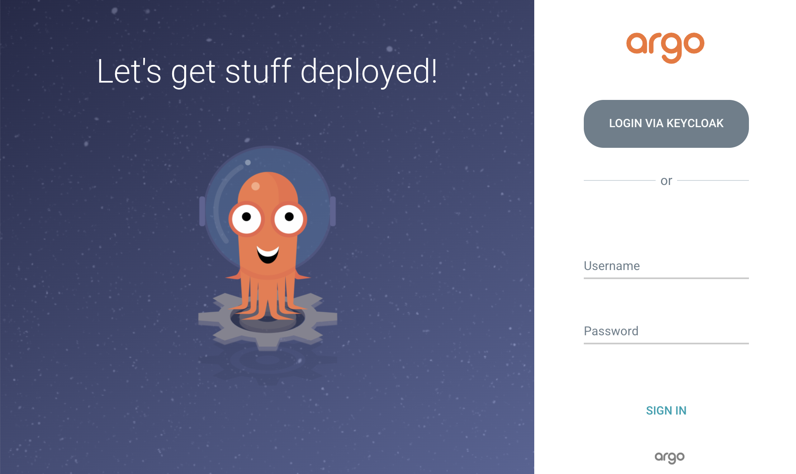

### **Keycloak Identity brokering with OpenShift OAuthClient**

Prior to configuring OpenShift 4 Identity Provider, please locate the correct OpenShift 4 API URL up. The easiest way to obtain it is to invoke the following command (this might require [installing jq command](https://stedolan.github.io/jq/download/) separately) 

`curl -s -k -H "Authorization: Bearer $(oc whoami -t)" https://<openshift-user-facing-api-url>/apis/config.openshift.io/v1/infrastructures/cluster | jq ".status.apiServerURL". `

In most cases, the address will be protected by HTTPS. Therefore, it is essential to configure X509_CA_BUNDLE in the container and set it to /var/run/secrets/kubernetes.io/serviceaccount/ca.crt. Otherwise, Keycloak won’t be able to communicate with the API Server.

Go to Identity Providers and select Openshift v4. Set the Base Url to OpenShift 4 API URL. Client ID as keycloak-broker(can be anything) and Client Secret to any secret that you want to set in Step 7.

## **Registering an OAuth Client** 

```
kind: OAuthClient
apiVersion: oauth.openshift.io/v1
metadata:
 name: keycloak-broker 
secret: "..." 
redirectURIs:
"https://keycloak-keycloak.apps.dev-svc-4.7-020201.devcluster.openshift.com/auth/realms/myrealm/broker/openshift-v4/endpoint" 
grantMethod: prompt 
```

1. The name of the OAuth client is used as the client_id parameter when making requests to <namespace_route>/oauth/authorize and <namespace_route>/oauth/token.
2. The secret is used as the client_secret parameter when making requests to <namespace_route>/oauth/token.
3. The redirect_uri parameter specified in requests to <namespace_route>/oauth/authorize and <namespace_route>/oauth/token must be equal to or prefixed by one of the URIs listed in the redirectURIs parameter value.
4. The grantMethod is used to determine what action to take when this client requests tokens and has not yet been granted access by the user. Specify auto to automatically approve the grant and retry the request, or prompt to prompt the user to approve or deny the grant.


Now you can log into Argo CD using your Openshift Credentials through Keycloak as an Identity Broker.


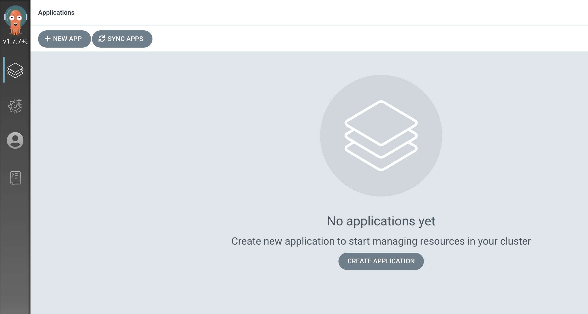

**Configure Groups and Argo CD RBAC**

After this point, You must provide relevant access to the user to create applications, projects e.t.c.,. This can be achieved in two steps.

1. Add the logged in user to the keycloak group *ArgoCDAdmins* created earlier. 

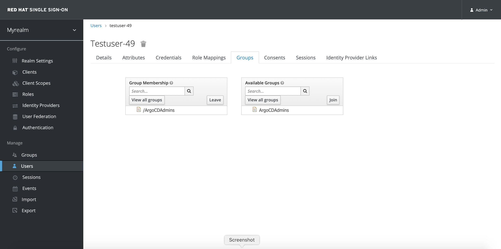

2. Make sure *ArgoCDAdmins* group has required permissions in the Argo CD-rbac configmap. Please refer to the Argo CD RBAC documentation [here](https://argoproj.github.io/argo-cd/operator-manual/rbac/).

In this case, I wish to provide admin access to the users in *ArgoCDAdmins* group 

`$ kubectl edit configmap argocd-rbac-cm -n openshift-gitops`

```
apiVersion: v1
kind: ConfigMap
metadata:
  name: argocd-rbac-cm
data:
  policy.csv: |
    g, ArgoCDAdmins, role:admin
```

### Working with Dex

**NOTE:** As of v1.3.0, Dex is automatically configured. You can log into the default Argo CD instance in the openshift-gitops namespace using the OpenShift or kubeadmin credentials. As an admin you can disable the Dex installation after the Operator is installed which will remove the Dex deployment from the openshift-gitops namespace.

**NOTE:** `DISABLE_DEX` environment variable & `.spec.dex` fields are no longer supported in OpenShift GitOps v1.10 onwards. Dex can be enabled/disabled by setting `.spec.sso.provider: dex` as follows

```
spec:
  sso:
    provider: dex
    dex:
      openShiftOAuth: true
```

`oc patch argocd argocd --type='merge' --patch='{ "spec": { "sso": { "provider": "dex", "dex": {"openShiftOAuth": true}}}}`

**NOTE:** Dex resource creation will not be triggered, unless there is valid Dex configuration expressed through `.spec.sso.dex`. This could either be using the default openShift configuration

```
spec:
  provider: dex
  sso:
    dex:
      openShiftOAuth: true
```

`oc patch argocd/openshift-gitops -n openshift-gitops --type='merge' --patch='{ "spec": { "sso": { "provider": "dex", "dex": {"openShiftOAuth": true}}}}`

or it could be custom Dex configuration provided by the user:

```
spec:
  sso:
    dex:
      config: <custom-dex-config>
```

`oc patch argocd/openshift-gitops -n openshift-gitops --type='merge' --patch='{ "spec": { "sso": { "provider": "dex", "dex": {"config": <custom-dex-config>}}}}`

**NOTE: Absence of either will result in an error due to failing health checks on Dex**

#### Uninstalling Dex

**NOTE:** `DISABLE_DEX` environment variable & `.spec.dex` fields are no longer supported in OpenShift GitOps v1.10 onwards. Please use `.spec.sso.provider` to enable/disable Dex.  

Dex can be uninstalled either by removing `.spec.sso` from the Argo CD CR, or switching to a different SSO provider.  

You can enable RBAC on Argo CD by following the instructions provided in the Argo CD [RBAC Configuration](https://argoproj.github.io/argo-cd/operator-manual/rbac/). Example RBAC configuration looks like this.

```
spec:
  sso:
    provider: dex
    dex:
      openShiftOAuth: true
  rbac:
    defaultPolicy: 'role:readonly'
    policy: |
      g, system:cluster-admins, role:admin
      g, ocp-admins, role:admin
    scopes: '[groups]'
```


`oc patch argocd/openshift-gitops -n openshift-gitops --type='merge' --patch='{ "spec": { "rbac": { "defaultPolicy": "role:readonly", "scopes": "[groups]", "policy": "g, system:cluster-admins, role:admin\ng, ocp-admins, role:admin" } } }'`


#### Restricting dex / openShiftOAuth to only a set of groups

As discussed here [https://cloud.redhat.com/blog/openshift-authentication-integration-with-argocd](https://cloud.redhat.com/blog/openshift-authentication-integration-with-argocd) you can restrict oauth access to certain groups. Currently it is not possible to restrict the Argo CD to only a set of groups, through `openShiftOAuth: true`, the RFE is tracked upstream [here](https://github.com/argoproj-labs/argocd-operator/issues/391). However, you can let the operator generate the oauth client and dex.config and then configure it manually and thus be able to extend it.

Assuming you have done the above steps to enable `openShiftOAuth: true`: you can use the following commands to:

1. fetch the current dex.config from the Config Map, extend it with the required groups (e.g. here cluster-admins)

2. disable the openShiftOAuth provisioning

3. Put the extended config as manual dex.config

This will disable any automatic (and further) full management of the dex / OpenShift integration.

```
oidc_config=$(oc get cm -n openshift-gitops argocd-cm -o json | jq '.data["dex.config"]' | sed 's@/callback@/callback\\n	groups:\\n  	- cluster-admins@' | sed 's/"//g')
oc patch argocd/openshift-gitops -n openshift-gitops --type='json' --patch='[{"op": "remove", "path": "/spec/sso/dex/openShiftOAuth" }]'
oc patch argocd/openshift-gitops -n openshift-gitops --type='merge' --patch="{ \"spec\": { \"sso\": { \"dex\": { \"config\": \"${oidc_config}\" } } } }"
```

## Getting started with GitOps Application Manager (kam)

### Download the kam CLI

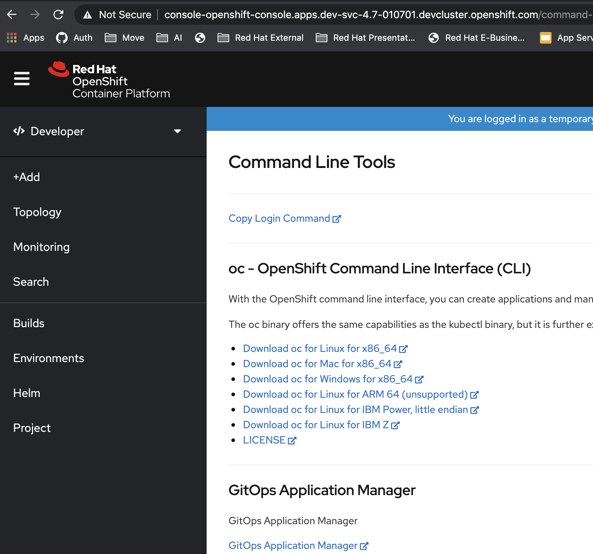

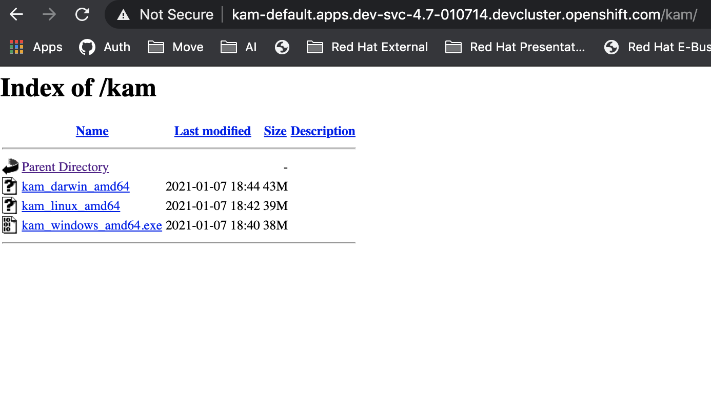


### **Bootstrap a GitOps repository**

[https://github.com/redhat-developer/kam/tree/master/docs/journey/day1](https://github.com/redhat-developer/kam/tree/master/docs/journey/day1)


## Setting up a new Argo CD instance

GitOps Operator installs an instance of Argo CD in **openshift-gitops**namespace with additional permissions, which allows it to manage certain cluster scoped resources.

If a user wishes to install their own instance for managing cluster configurations or deploying applications, the user can do so by deploying their own instance of Argo CD. 

The newly deployed instance, by default will only have the permissions to manage resources in the namespace where the Argo CD instance is being deployed. 

### Application Delivery

Multiple engineering teams may use their own instances of Argo CD to continuously deliver their applications. The recommended approach to doing so would be to let teams manage their own isolated Argo CD instances. 

The new instance of Argo CD is granted permissions to manage/deploy resources only for the namespace in which the instance is deployed. 

#### Argo CD Installation

1. To install an Argo CD instance, go to Installed Operators.

2. Create a new project or select an existing project where you want to install the Argo CD instance.

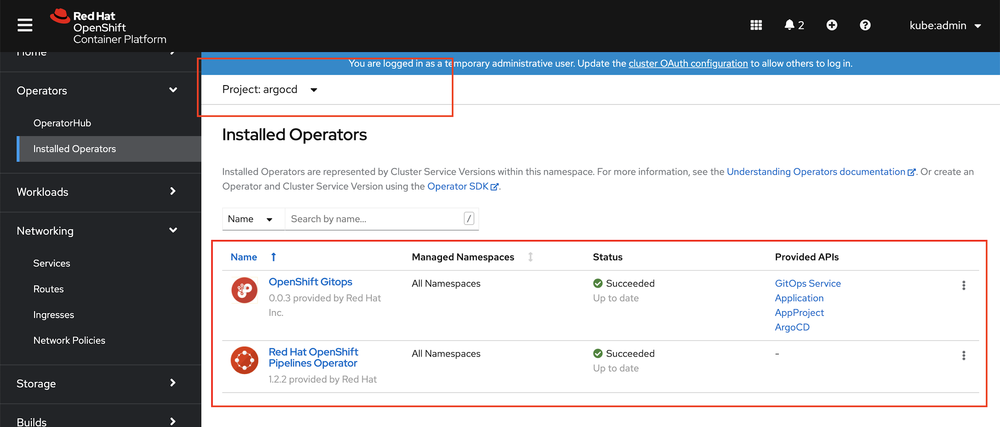

* Select Openshift GitOps Operator from installed operators and select Argo CD tab.

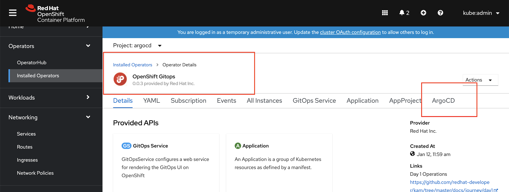

* Click on "Create" button to create Argo CD Instance and specify following configuration:

    * Name: /<argocd-instance-name/>

    * Server -> Route -> Enable Route = true (creates an external OS Route to access Argo CD server)

* Open the Argo CD web UI by clicking on the route which is created in the project where the Argo CD is installed.

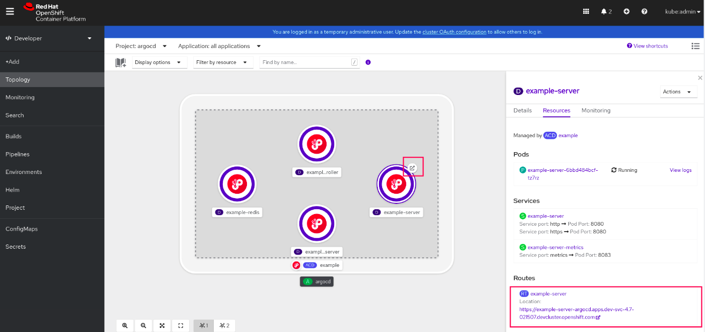 

#### **Enable Replicas for Argo CD Server and Repo Server**

A user can enable a number of replicas for the Argo CD-server and Argo CD-repo-server workloads. As these workloads are stateless, the replica count can be increased to distribute the workload better among pods. However, if a horizontal autoscaler is enabled on Argo CD-server, it will be prioritized over the number set for replicas.

**Example**

```
apiVersion: argoproj.io/v1beta1
kind: ArgoCD
metadata:
  name: example-argocd
  labels:
    example: repo
spec:
  repo:
    replicas: 1
  server:
    replicas: 1
    route:
      enabled: true
      path: /
      tls:
        insecureEdgeTerminationPolicy: Redirect
        termination: passthrough
      wildcardPolicy: None
```

#### Enable Notifications with Argo CD instance

Argo CD Notifications controller can be enabled/disabled using a new toggle within the Argo CD CR with default specs as follows:

``` yaml
apiVersion: argoproj.io/v1beta1
kind: ArgoCD
metadata:
  name: example-argocd
spec:
  notifications:
    enabled: True
```

Notifications are disabled by default. Please refer to [upstream documentation](https://argocd-operator.readthedocs.io/en/latest/usage/notifications/) for further information

#### Deploy resources to a different namespace

To grant Argo CD the permissions to manage resources in multiple namespaces, we need to configure the namespace with a label **"Argo CD.argoproj.io/managed-by"** and the value being the **namespace** of the Argo CD instance meant to manage the namespace. 

**Example**: For Argo CD instance deployed in the namespace `foo` wants to manage resources in namespace `bar`.

* Create the following yaml named namespace.yaml ( available from July 21st / GitOps 1.2 )

```
apiVersion: v1
kind: Namespace
metadata:
  name: bar // new namespace to be managed by an existing Argo CD instance
  labels:
    argocd.argoproj.io/managed-by: foo // namespace of the Argo CD instance
```


* Then, run the following command to create/configure the namespace. 

`oc apply -f namespace.yaml`

### Via Openshift Console - 

On Openshift Console, as an admin, navigate to **User Management -> Role Bindings ->** select **Create Binding.**

This would open up a form, which would guide you through the process of creating a RoleBinding. 

* For Binding Type select **Namespace role binding (RoleBinding)**

    * We only need to provide the Binding Type, if selected Project is "All Projects"

    * If the Project is already selected as the one you want to create RoleBinding for, it does not ask for Binding Type and assumes it to be a RoleBinding. 

* Under Role Binding, provide a RoleBinding **Name** and **Namespace**(the one you are granting permissions for).

* For Role, Select the Cluster Role** admin** (CR admin) from the drop down list. 

* Under Subject, Select **Service Account** and the provide the Subject Namespace and Name. For our example it would be -

    * Subject Namespace: openshift-gitops

    * Subject Name: openshift-gitops-argocd-application-controller

* Click on **Create** to create the RoleBinding

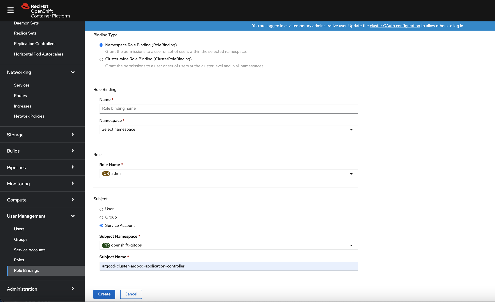

#### Deploy resources to a different namespace with custom role

As an administrative user, when you give Argo CD access to a namespace by using the `argocd.argoproj.io/managed-by` label, it assumes namespace-admin privileges. These privileges are an issue for administrators who provide namespaces to non-administrators, such as development teams, because the privileges enable non-administrators to modify objects such as network policies.

With this update, administrators can configure a common cluster role for all the managed namespaces. In role bindings for the Argo CD application controller, the Operator refers to the `CONTROLLER_CLUSTER_ROLE` environment variable. In role bindings for the Argo CD server, the Operator refers to the `SERVER_CLUSTER_ROLE` environment variable. If these environment variables contain custom roles, the Operator doesn’t create the default admin role. Instead, it uses the existing custom role for all managed namespaces.

**Example**: Custom role environment variables in operator Subscription:

```
apiVersion: operators.coreos.com/v1beta1
kind: Subscription
metadata:
  name: argocd-operator
  namespace: argocd
spec:
  config:
    env:
    - name: CONTROLLER_CLUSTER_ROLE
      value: custom-controller-role
    - name: SERVER_CLUSTER_ROLE
      value: custom-server-role
```

**Example**: Custom role environment variables in operator Deployment:

```
kind: Deployment
apiVersion: apps/v1
metadata:
  name: argocd-operator-controller-manager
  namespace: argocd
spec:
  replicas: 1
  template:
    spec:
      containers:
          env:
          - name: CONTROLLER_CLUSTER_ROLE
            value: custom-controller-role
          - name: SERVER_CLUSTER_ROLE
            value: custom-server-role
```


### Cluster Configuration

When the user wishes to install Argo CD with the purpose of managing OpenShift cluster resources, Argo CD is granted permissions to [manage specific cluster-scoped resources](https://docs.google.com/document/d/1HncLIPlUkO5rfTHCi4zAygB6Xx6K3dAgI5PM5GT1G6A/edit#heading=h.e3snv4wit2fc) which include [platform operators](https://docs.openshift.com/container-platform/4.6/architecture/control-plane.html#platform-operators_control-plane), optional OLM operators, user management, etc. **Argo CD is not granted cluster-admin**.

###  In-built permissions for cluster configuration

Argo CD is granted the following permissions to manage specific cluster-scoped resources which include platform operators, optional OLM operators and user management. **Argo CD is not granted cluster-admin**.


User can extend the permissions provided to Argo CD instance by following the steps provided in this [section](#heading=h.8m0tejtgffa7)  


<table>
  <tr>
    <td>Resource Groups</td>
    <td>What does it configure for the user/administrator</td>
  </tr>
  <tr>
    <td>operators.coreos.com</td>
    <td>Optional operators managed by OLM</td>
  </tr>
  <tr>
    <td>user.openshift.io , rbac.authorization.k8s.io</td>
    <td>Groups, Users and their permissions.</td>
  </tr>
  <tr>
    <td>config.openshift.io</td>
    <td>Control plane Operators managed by CVO used to configure cluster-wide build configuration, registry configuration, scheduler policies, etc.</td>
  </tr>
  <tr>
    <td>storage.k8s.io</td>
    <td>Storage.</td>
  </tr>
  <tr>
    <td>console.openshift.io</td>
    <td>Console customization.</td>
  </tr>
</table>


#### Argo CD Installation

To manage cluster-config, deploy an ArgoCD instance using the steps provided above. 

* As an admin, update the existing Subscription Object for Gitops Operator and add `ARGOCD_CLUSTER_CONFIG_NAMESPACES` to the spec.

* On Openshift Console, go to * **Administration -> CustomResourceDefinition -> Subscription -> Instances** and select **"openshift-gitops-operator".**


Select the **YAML** tab and edit the Subscription yaml to add ENV, **ARGOCD_CLUSTER_CONFIG_NAMESPACES** as defined below.

```
spec:
  config:
    env:
    - name: ARGOCD_CLUSTER_CONFIG_NAMESPACES
      value: openshift-gitops, <namespace where Argo CD instance is installed>
```

#### Default Permissions provided to Argo CD instance

By default Argo CD instance is provided the following permissions - 

* Argo CD instance is provided with ADMIN privileges for the namespace it is installed in. For instance, if an Argo CD instance is deployed in **foo** namespace, it will have **ADMIN privileges** to manage resources for that namespace. 

* Argo CD is provided the following cluster scoped permissions because Argo CD requires cluster-wide read privileges on resources to function properly. (Please see https://argo-cd.readthedocs.io/en/stable/operator-manual/security/#cluster-rbac for more details.): 

```
 - verbs:
    - get
    - list
    - watch
   apiGroups:
    - '*'
   resources:
    - '*'
 - verbs:
    - get
    - list
   nonResourceURLs:
    - '*'
```


* Argo CD instance is provided additional Cluster Scoped permissions if it is used for Cluster Config Management as defined above ([https://docs.google.com/document/d/1147S5yOdj5Golj3IrTBeeci2E1CjAkieGCcl0w90BS8/edit?pli=1#heading=h.itev1vnvtlyl](#heading=h.itev1vnvtlyl))

```
- verbs:
    - '*'
   apiGroups:
    - operators.coreos.com
   resources:
    - '*'
 - verbs:
    - '*'
   apiGroups:
    - operator.openshift.io
   resources:
    - '*'
 - verbs:
    - '*'
   apiGroups:
    - user.openshift.io
   resources:
    - '*'
 - verbs:
    - '*'
   apiGroups:
    - config.openshift.io
   resources:
    - '*'
 - verbs:
    - '*'
   apiGroups:
    - console.openshift.io
   resources:
    - '*'
 - verbs:
    - '*'
   apiGroups:
    - ''
   resources:
    - namespaces
    - persistentvolumeclaims
    - persistentvolumes
    - configmaps
 - verbs:
    - '*'
   apiGroups:
    - rbac.authorization.k8s.io
   resources:
    - '*'
 - verbs:
    - '*'
   apiGroups:
    - storage.k8s.io
   resources:
    - '*'
 - verbs:
    - '*'
   apiGroups:
    - machine.openshift.io
   resources:
    - '*'
```

#### Additional permissions

If the user wishes to expand the permissions granted to Argo CD, they need to create Cluster Roles with additional permissions and then a new Cluster Role Binding to associate them to a Service Account. 

For understanding, we will extend the permissions for pre-installed Argo CD instance to be able to list the secrets for all namespaces. 

##### 	Create Cluster Role

##### Via OpenShift Console-

* On Openshift Console, as an admin, navigate to **User Management -> Roles -> Create Role**

* Use the following ClusterRole Yaml template and add rules to specify the additional permissions. For our example, we are adding the permissions to list the secrets for all namespaces. 

* Click on **Create**

##### Via CLI - 

* Alternatively, user can create the following yaml using the command - 

`oc create -f <path-to-following-yaml`

```
apiVersion: rbac.authorization.k8s.io/v1
kind: ClusterRole
metadata:
  # "namespace" omitted since ClusterRoles are not namespaced
  name: secrets-cluster-role
rules:
- apiGroups: [""] #specifies core api groups
  resources: ["secrets"]
  verbs: ["*"]
```


##### 	Create Cluster Role Binding

##### Via CLI - 

* Create the following yaml named cluster_role_binding.yaml

```
apiVersion: rbac.authorization.k8s.io/v1
# This cluster role binding allows Service Account to read secrets in any namespace.
kind: ClusterRoleBinding
metadata:
  name: read-secrets-global
roleRef:
  apiGroup: rbac.authorization.k8s.io
  kind: ClusterRole
  name: secrets-cluster-role # Name of cluster role to be referenced
subjects:
- kind: ServiceAccount
  name: openshift-gitops-argocd-application-controller
  namespace: openshift-gitops 
```


* Use the following command to create Cluster Role Binding with the yaml provided above -

		
`oc create -f cluster_role_binding.yaml`
	

##### Via OpenShift Console -

* On OpenShift Console, as an admin, navigate to **User Management -> Role Bindings -> Create Binding**

* Under the Projects tab, make sure you have selected "All Projects", if not then select it.

* Select Binding Type as **Cluster-wide role binding (ClusterRoleBinding)**

* Provide Role Binding Name, this should be unique, example - "read-secrets-global"

* Select the Cluster Role created in previous steps or any existing cluster role from the drop down list. For our example, we will select "secrets-cluster-role" from the list.

* Under Subject, Select **Service Account** and the provide the Subject Namespace and Name. For our example it would be -

    * Subject Namespace: openshift-gitops

    * Subject Name: openshift-gitops-argocd-application-controller

* Click on **Create** to create the Cluster Role Binding

## Configure resource quota/requests for OpenShift GitOps workloads

This section covers the steps to create, update and delete resource requests and limits for Argo CD workloads.

The Argo CD Custom Resource allows you to create the workloads with desired resource requests and limits. This is required when a user/admin wishes to deploy his Argo CD instance in a namespace that is set with [Resource Quota](https://kubernetes.io/docs/concepts/policy/resource-quotas/).

For example, the below Argo CD instance deploys the Argo CD workloads such as Application Controller, ApplicationSet Controller, Dex, Redis, Repo Server and Server with resource requests and limits. Similarly you can also create the other workloads with resource requirements.

**Note:** The resource requirements for the workloads in the below example are not the recommended values. Please do not consider them as defaults for your instance.

```
apiVersion: argoproj.io/v1beta1
kind: ArgoCD
metadata:
  name: example
spec:
  server:
    resources:
      limits:
        cpu: 500m
        memory: 256Mi
      requests:
        cpu: 125m
        memory: 128Mi
    route:
      enabled: true
  applicationSet:
    resources:
      limits:
        cpu: '2'
        memory: 1Gi
      requests:
        cpu: 250m
        memory: 512Mi
  repo:
    resources:
      limits:
        cpu: '1'
        memory: 512Mi
      requests:
        cpu: 250m
        memory: 256Mi
  sso:
    dex:
      resources:
        limits:
          cpu: 500m
          memory: 256Mi
        requests:
          cpu: 250m
          memory: 128Mi
  redis:
    resources:
      limits:
        cpu: 500m
        memory: 256Mi
      requests:
        cpu: 250m
        memory: 128Mi
  controller:
    resources:
      limits:
        cpu: '2'
        memory: 2Gi
      requests:
        cpu: 250m
        memory: 1Gi
```

### Patch the Argo CD instance to update the resource requirements

A User can update the resource requirements for all or any of your workloads post installation.

For example, A user can update the Application Controller **resource requests** of an Argo CD instance named "example" in Argo CD namespace using the below commands.

`kubectl -n argocd patch argocd example --type='json' -p='[{"op": "replace", "path": "/spec/controller/resources/requests/cpu", "value":"1"}]'`

`kubectl -n argocd patch argocd example --type='json' -p='[{"op": "replace", "path": "/spec/controller/resources/requests/memory", "value":"512Mi"}]'`


Similarly, A user can update the Application Controller **resource limits** of an Argo CD instance named "example" in Argo CD namespace using the below commands.

`kubectl -n argocd patch argocd example --type='json' -p='[{"op": "replace", "path": "/spec/controller/resources/limits/cpu", "value":"4"}]'`

`kubectl -n argocd patch argocd example --type='json' -p='[{"op": "replace", "path": "/spec/controller/resources/limits/memory", "value":"2048Mi"}]'`

**The above commands can be modified to replace application controller with any other OpenShift GitOps workloads such as ApplicationSet Controller, Dex, Redis, Repo Server, Server, Keycloak e.t.c.,.**

### Remove the resource requirements for Argo CD workloads

A User can also remove resource requirements for all or any of your workloads post installation.

For example, A user can remove the Application Controller resource requests an Argo CD instance named "example" in Argo CD namespace using the below command.

`kubectl -n argocd patch argocd example --type='json' -p='[{"op": "remove", "path": "/spec/controller/resources/requests/cpu"}]'`

`kubectl -n argocd patch argocd example --type='json' -p='[{"op": "remove", "path": "/spec/controller/resources/requests/memory"}]'`

Similarly, A user can remove the Application Controller resource limits of example Argo CD instance in Argo CD namespace using the below command.

`kubectl -n argocd patch argocd example --type='json' -p='[{"op": "remove", "path": "/spec/controller/resources/limits/cpu"}]'`

`kubectl -n argocd patch argocd example --type='json' -p='[{"op": "remove", "path": "/spec/controller/resources/limits/memory"}]'`


The above commands can be modified to replace controller with any other Argo CD workloads such as ApplicationSet Controller, Dex, Redis, Repo Server, Server and others.

## Running default Gitops workloads on Infrastructure Nodes

Infrastructure nodes prevent additional billing cost against subscription counts. 
OpenShift allows certain workloads installed by the OpenShift GitOps Operator to run on Infrastructure Nodes. This comprises the workloads that are installed by the GitOps Operator by default in the openshift-gitops namespace, including the default Argo CD instance in that namespace.
Note: Other Argo CD instances installed to user namespaces are not eligible to run on Infrastructure nodes.
	
Follow the steps to move these default workloads to infrastructure node
* kam deployment
* cluster deployment (backend service)
* openshift-gitops-applicationset-controller deployment
* openshift-gitops-dex-server deployment
* openshift-gitops-redis deployment
* openshift-gitops-redis-ha-haproxy deployment
* openshift-gitops-repo-sever deployment
* openshift-gitops-server deployment
* openshift-gitops-application-controller statefulset
* openshift-gitops-redis-server statefulset
	
#### Adding label to existing nodes

	
* Please refer to official docs about infrastructure nodes -                                                   [https://access.redhat.com/solutions/5034771](https://access.redhat.com/solutions/5034771) [https://docs.openshift.com/container-platform/4.6/machine_management/creating-infrastructure-machinesets.html](https://docs.openshift.com/container-platform/4.6/machine_management/creating-infrastructure-machinesets.html) 

* Label your existing nodes as **Infrastructure** via cli or from openshift UI -  

`oc label node <node-name> node-role.kubernetes.io/infra=""`


* To isolate the workloads on Infra nodes and prevent other workloads to schedule on these nodes, **taints** can be applied on these nodes, for example a sample taint can be added from cli - 

`oc adm taint nodes -l node-role.kubernetes.io/infra infra=reserved:NoSchedule infra=reserved:NoExecute`

#### Add *runOnInfra* toggle in the GitopsService CR to add infra node selector

`oc edit gitopsservice -n openshift-gitops`

```
apiVersion: pipelines.openshift.io/v1alpha1
kind: GitopsService
metadata:
  name: cluster
spec:
  runOnInfra: true
```

#### Add *tolerations* to the GitopsService CR

If taints are added to your nodes you can add tolerations in the CR, sample toleration - 

`oc edit gitopsservice -n openshift-gitops`

```
apiVersion: pipelines.openshift.io/v1alpha1
kind: GitopsService
metadata:
  name: cluster
      spec:
  runOnInfra: true
  tolerations:
  - effect: NoSchedule
    key: infra
    value: reserved
  - effect: NoExecute
    key: infra
    value: reserved 
```

###### Verify that the workloads in  openshift-gitops  namespace are now scheduled on infrastructure nodes, if you click on any pod and see its details, you can see the nodeSelector and tolerations added.

Note - Any manually added nodeSelectors and tolerations in the default Argo CD CR will be overwritten by the toggle and tolerations in gitops service CR.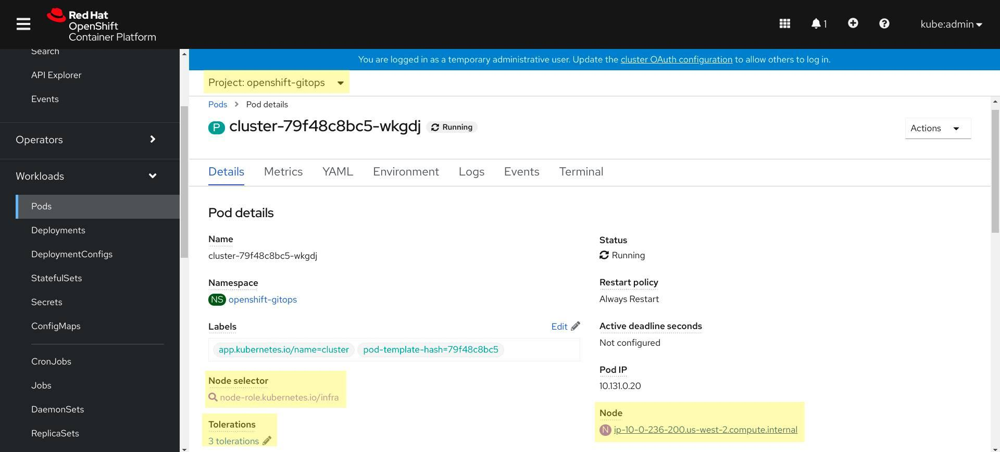

## Using NodeSelector and Tolerations in Default Instance of Openshift GitOps	

Users can set custom nodeSelectors and tolerations in their default workloads by editing their GitopsService CR like so:

```
kind: GitopsService
metadata:
  name: cluster	
spec:
  nodeSelector:
    key1: value1
  tolerations:
  - effect: NoSchedule
    key: key1
    value: value1 	
```
	
Note: The operator also has default nodeSelector for Linux, and runOnInfra toggle also sets Infrastructure nodeSelector in the workloads. All these nodeSelectors will be merged with precedence given to the custom nodeSelector in case the keys match.
	

## Managing MachineSets with OpenShift GitOps

Machinesets are resources that are created during an OpenShift cluster's installation and can be used to manipulate compute units or "machines" on said OpenShift cluster. They typically contain cluster specific information such as availability zones that are hard to predict, and randomly generated names that cannot be known beforehand. As such, machinesets are hard targets to manage in a GitOps way. However, users wanting to manage their machinests using Argo CD can still do so, with a little manual effort, by leveraging server-side apply.

Users can manually find out the resource names for the machinesets available on their clusters by running the command:
`oc get machinesets -n openshift-machine-api`

Users can then create a patch for this resouce by only expressing the name of the target machineset and the specific set of fields and values that they would like to modify and manage through Argo CD. For example:

```
apiVersion: machine.openshift.io/v1beta1
kind: MachineSet
metadata:
  name: rhoms-4-10-081004-6jgmc-worker-us-east-2a
spec:
  replicas: 3

```

Users can store the above described patch within their GitOps repositories to be applied and managed along with other Argo CD managed resources.

[Kubernetes Server Side Apply](https://kubernetes.io/docs/reference/using-api/server-side-apply/) allows users to patch existing resources and manage specific sets of fields only by setting the 'field manager' for those fields appropriately. Argo CD will soon include the ability to support server-side apply for manifests as described in this [accepted proposal](https://github.com/argoproj/argo-cd/blob/master/docs/proposals/server-side-apply.md#server-side-apply-support-for-argocd). Users will have the option to express that they would like to enforce server-side apply through a new sync option either at application level, or at individual resource level by leveraging appropriate annotations (more details [here](https://github.com/argoproj/argo-cd/blob/master/docs/proposals/server-side-apply.md#use-cases)).

On following these steps, users should be able to manage their machinesets using Argo CD v2.5 and upwards (available with OpenShift GitOps v1.7 and upwards). They should be able to have Argo CD apply their patches to existing resources using server-side apply, see the changes reflected on cluster, and have the 'field manager' updated appropriately for their resources. 

## Monitoring 

OpenShift GitOps automatically detects Argo CD instances on the cluster and wires them up with the cluster monitoring stack with one alert installed out-of-the-box for reporting out-of-sync apps. No additional configuration is required.

Note that the metrics provided are for the Argo CD instance itself, and don’t include metrics provided by the applications.

To run simple queries against the Argo CD metrics, you can go to the metrics page of the Developer Console, select the namespace that Argo CD was installed into, select the Metrics tab, and enter a PromQL query in the custom queries field, for example

<table>
  <tr>
    <td>sum(argocd_app_info{dest_namespace=~"default",health_status!=""}) by (health_status)</td>
  </tr>
</table>


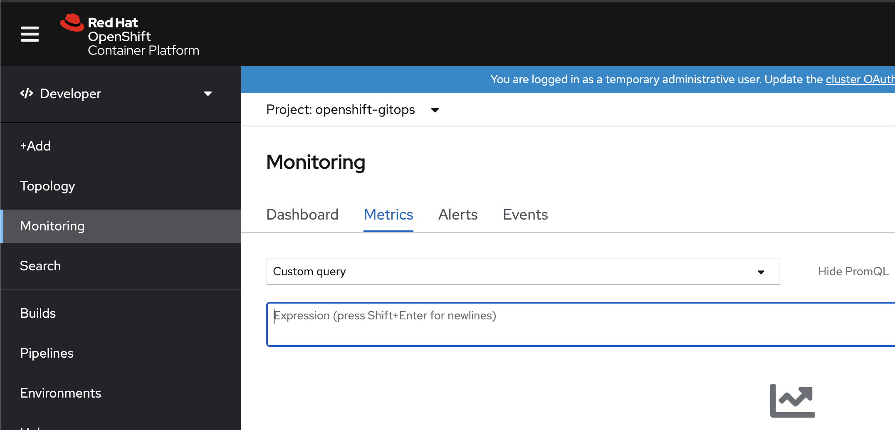

To take full advantage of the metrics provided by Argo CD, you can install Grafana to help analyze and visualize the metrics.  This [blog post](https://www.redhat.com/en/blog/custom-grafana-dashboards-red-hat-openshift-container-platform-4) walks you through deploying a custom Grafana instance to your cluster using the community provided Grafana operator.  *Note that community Operators are operators which have not been vetted or verified by Red Hat. Community Operators should be used with caution because their stability is unknown. Red Hat provides no support for Community Operators.*

The Argo CD project provides a sample Grafana dashboard [here](https://github.com/argoproj/argo-cd/blob/master/examples/dashboard.json) which can be imported into installed Grafana instance.

## Logging 

To store and retrieve logs, a user can choose to leverage the Logging Stack provided by OpenShift. It provides a better visualization of logs using Kibana Dashboard. To integrate Argo CD with OpenShift Logging stack, OpenShift Logging default options enable logging with Argo CD.  No additional configuration is required.

#### Navigating Argo CD logs using the Kibana Dashboard

As a prerequisite, OpenShift Logging with default options is installed

Steps:

* First, we need to open the Kibana Dashboard. Users can access the Kibana Dashboard by clicking **Logging** under the **Observability** tab. 

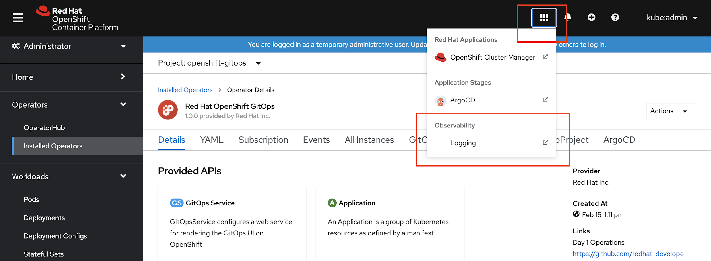

* If this is the first time the Kibana dashboard is launched, an index pattern needs to be created in Kibana. A simple `"*"` index will do for now.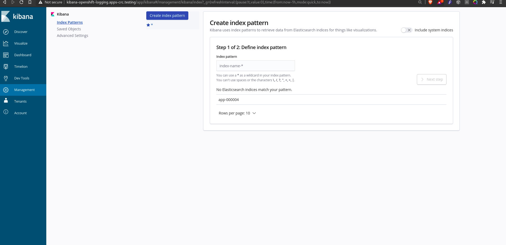

Use **_@timestamp_** as Time Filter Field Name. 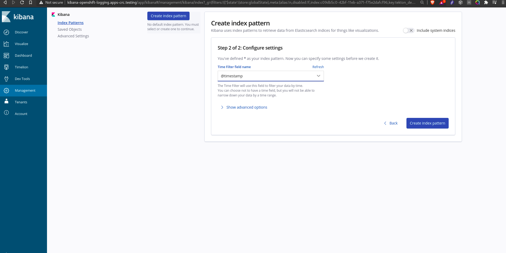

* After the creation of the Index, select the **_Discover_**  tab on the left hand side. Provide filters to retrieve logs for Argo CD. 

Following filters can be created to retrieve logs for OOTB Argo CD instance in **openshift-gitops** namespace

* Under the search bar, click on "add a filter".

* Provide `kubernetes.namespace_name` as the filter with value `openshift-gitops`. This filter would retrieve logs for all the pods in "openshift-gitops" namespace. 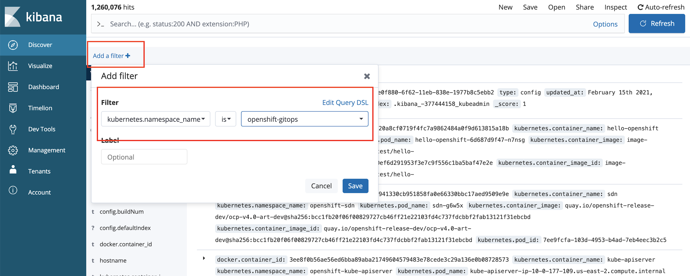  

* To retrieve logs for particular pods, additional filters like **kubernetes.pod_name** can be added to the filter list.

* Once the filter is created, users can see the filtered logs on the dashboard. 

## Prevent auto-reboot during Argo CD sync with machine configs

Nodes in [Red Hat OpenShift](https://developers.redhat.com/openshift) can be updated automatically through OpenShift's Machine Config Operator (MCO). A machine config is a custom resource that helps a cluster manage the complete life cycle of its nodes. When a machine config resource is created or updated in a cluster, the MCO picks up the update, performs the necessary changes to the selected nodes, and restarts the nodes gracefully by cordoning, draining, and rebooting them. The MCO handles everything ranging from the kernel to the kubelet.

However, interactions between the MCO and the [GitOps workflow](https://developers.redhat.com/topics/gitops) can introduce major performance issues and other undesired behavior. This article shows how to make the MCO and the [Argo CD](https://argoproj.github.io/) GitOps orchestration tool work well together.

## **Machine configs and Argo CD: Performance challenges**

When using machine configs as part of a GitOps workflow, the following sequence can produce suboptimal performance:

1. Argo CD starts a [sync job](https://argo-cd.readthedocs.io/en/stable/user-guide/auto_sync/) after a commit to the Git repository containing application resources.

2. If Argo CD notices a new or changed machine config while the sync operation is ongoing, MCO picks up the change to the machine config and starts rebooting the nodes to apply it.

3. If any of the nodes that are rebooting contain the Argo CD application controller, the application controller terminates and the application sync is aborted.

Because the MCO reboots the nodes in sequential order, and the Argo CD workloads can be rescheduled on each reboot, it could take some time for the sync to be completed. This could also result in undefined behavior until the MCO has rebooted all nodes affected by the machine configs within the sync.

For more details and implementation, please refer to this [blog post](https://developers.redhat.com/articles/2021/12/20/prevent-auto-reboot-during-argo-cd-sync-machine-configs#). 

## Health status of OpenShift resources

This enhancement adds support to display the Health status of OpenShift resources like DeploymentConfig, routes and Operators that you install using OLM. This enables you to better monitor the overall health status of your application.

Create an Argo CD Application with the below details.

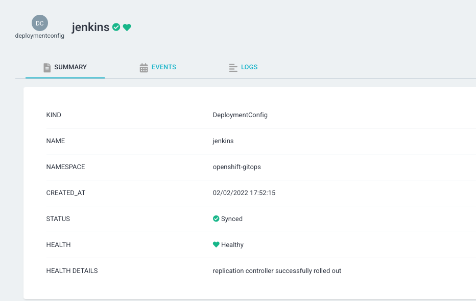


Sync the application and wait for the resources to be created. After a while you will notice that the deployment config resource is created. Click on the deployment config resource to get the health and status information.

 


## Upgrade GitOps Operator from v1.0.1 to v1.1.0 (GA)

On upgrade from v1.0.1, GitOps operator renames the default Argo CD instance created in **openshift-gitops namespace** from **argocd-cluster** to **openshift-gitops.** 

This is a breaking change and needs some manual steps to be performed before the upgrade. 

1. Before the upgrade, store the content (data) of *argocd-cm**locally. 

2. Delete the **argocd-cluster**instance (default Argo CD instance) that is present in the cluster. 

3. Upgrade the GitOps Operator. 

4. Apply the patch manually from the **argocd-cm**for the resources that were previously present on the previous Argo CD instance

5. Login to Argo CD cluster and check if the previous configurations are present. 

## Upgrade GitOps Operator from v1.1.2 to v1.2.0 (GA)

On upgrade from v1.1.2 to v1.2.0, GitOps operator updates the **openshift-gitops** namespace with [ResourceQuota](https://kubernetes.io/docs/concepts/policy/resource-quotas/). Which means, any newly created pods in this namespace should have resource requests and limits. 

If you find any issues with respect to pods moving into pending state or error state, please verify if the pod has resource requests/limits set. If not, Either update the pods with resource requests/limits or run the below command to remove the ResourceQuota object.

`oc delete resourcequota openshift-gitops-compute-resources -n openshift-gitops`

## Upgrade GitOps Operator to v1.10 (GA)

GitOps Operator v1.10 introduces breaking changes in SSO configurations. `.spec.dex`, `.spec.sso.image`, `.spec.sso.version`, `.spec.sso.resources` and `.spec.sso.verifyTLS` fields in ArgoCD CR are no longer supported to configure dex/keycloak SSO. If you are using these fields, please update your ArgoCD CR to use equivalent fields under `.spec.sso` for dex/keycloak SSO configurations before upgrading to v1.10.  

Refer [Working with Dex](#working-with-dex) section for more details. 

## GitOps Monitoring Dashboards 

As of GitOps Operator v1.10.0, the operator will deploy monitoring dashboards in the console Admin perspective. When navigating to *Observe* → *Monitoring* in the console, users should see three GitOps dashboards in the dropdown dashboard list: GitOps Overview, GitOps Components, and GitOps gRPC. These dashboards are based on the upstream Argo CD dashboards but have been modified to work with OpenShift console. 

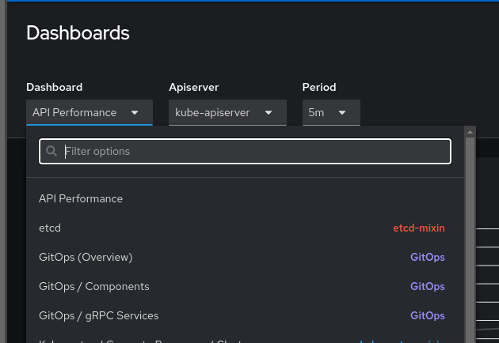

**Note: At this time disabling or changing the content of the dashboards is not supported.**
