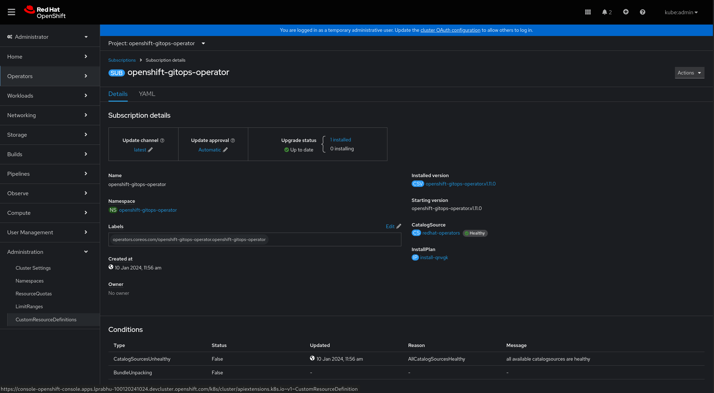

# OpenShift GitOps Usage Guide

## Table of Contents
1. [Installing OpenShift GitOps](#installing-openshift-gitops)  
2. [Configure SSO for OpenShift GitOps](#configure-sso-for-openshift-gitops)   
    a. [Dex](#dex)  
    b. [RHSSO / Keycloak](#rhssokeycloak)  
4. [Setting environment variables](#setting-environment-variables)    
6. [Getting started with GitOps Application Manager (kam)](#getting-started-with-gitops-application-manager-kam)  
7. [Setting up a new ArgoCD instance](#setting-up-a-new-argo-cd-instance)  
8. [Configure resource quota/requests for OpenShift GitOps workloads](#configure-resource-quotarequests-for-openshift-gitops-workloads)  
9. [Running default Gitops workloads on Infrastructure Nodes](#running-default-gitops-workloads-on-infrastructure-nodes)  
10. [Using NodeSelector and Tolerations in Default Instance of Openshift GitOps](#using-nodeselector-and-tolerations-in-default-instance-of-openshift-gitops)
11. [Monitoring](#monitoring)  
12. [Logging](#logging)  
13. [Prevent auto-reboot during Argo CD sync with machine configs](#prevent-auto-reboot-during-argo-cd-sync-with-machine-configs)  
14. [Machine configs and Argo CD: Performance challenges](#machine-configs-and-argo-cd-performance-challenges)  
15. [Health status of OpenShift resources](#health-status-of-openshift-resources)  
16. [Upgrade GitOps Operator from v1.0.1 to v1.1.0 (GA)](#upgrade-gitops-operator-from-v101-to-v110-ga)  
17. [Upgrade GitOps Operator from v1.1.2 to v1.2.0 (GA)](#upgrade-gitops-operator-from-v112-to-v120-ga) 
18. [GitOps Monitoring Dashboards](#gitops-monitoring-dashboards) 
19. [Integrate GitOps with Secrets Management](Integrate%20GitOps%20with%20Secrets%20Management.md)
20. [Using ApplicationSets](#using-applicationsets)

## Installing OpenShift GitOps

#### Terminologies:

* **Update channel**: Choose the channel according to the required operator version. latest channel points to the latest released version

  **Note**: For installing a z stream release, upgrade the operator in the respective versioned channel (or in the latest accordingly)
* **Installation mode**: As mentioned, the operator is only supported in default mode, retaining the value as is.
* **Installed Namespace**: openshift-operators namespace was the default installation namespace. Starting 1.10.0, we support installation in openshift-gitops-operator namespace as default. Choosing this namespace and enabling the Namespace monitoring option below, enables the monitoring. openshift-operators can also be used as the installation namespace but monitoring wouldn’t be possible with this namespace.
* **Update approval**: As the name suggests, with Automatic approval, updates are applied automatically, whereas with Manual approval, updates would require Manual intervention
* **Console plugin**: Enable/ Disable console plugin


### Operator Install GUI

To install OpenShift GitOps, find the OpenShift GitOps Operator in OperatorHub by typing "gitops" in the search box and click on the OpenShift GitOps Operator.


The Operator UI guides you through to install the OpenShift GitOps Operator.  You can go ahead with the default installation options (this operator installs to all namespaces on the cluster).


Click the "Install" button to finish the installation.


* * *


### Operator Install CLI

To install the Operator via the CLI, you will need to create a Subscription.

```
apiVersion: operators.coreos.com/v1alpha1
kind: Subscription
metadata:
  name: openshift-gitops-operator
  namespace: <Installed namespace>
  labels:
    operators.coreos.com/openshift-gitops-operator.openshift-operators: ''
spec:
  channel: <Update channel>
  installPlanApproval: <Update approval>
  name: openshift-gitops-operator
  source: redhat-operators
  sourceNamespace: openshift-marketplace
  startingCSV: openshift-gitops-operator.v<version of the operator>
```


Then, you apply this to the cluster.

`$ oc apply -f openshift-gitops-sub.yaml`

#### Note: 
* startingCSV parameter in the subscription allows you to choose the required version
* If you want the Installed namespace to be openshift-gitops-operator
    * Create the namespace and the OperatorGroup before applying the subscription
    * You can enable cluster monitoring manually by adding the below mentioned label

```
// Create the namespace
$ oc create ns openshift-gitops-operator

// Create the OperatorGroup
$ oc create -f - <<EOF
apiVersion: operators.coreos.com/v1
kind: OperatorGroup
metadata:
  name: openshift-gitops-operator
  namespace: openshift-gitops-operator
spec:
  upgradeStrategy: Default

// Enable cluster monitoring
$ oc label namespace openshift-gitops-operator openshift.io/cluster-monitoring=true
```

After a while (about 1-2 minutes), you should see the following Pods appear.

```
$ oc get pods -n openshift-gitops 
NAME                                                         READY   STATUS    RESTARTS   AGE
cluster-65885cfb44-x6lx4                                     1/1     Running   0          55s
gitops-plugin-58b577c9c9-p78xl                               1/1     Running   0          55s
kam-84c7c688c7-5h6pz                                         1/1     Running   0          55s
openshift-gitops-application-controller-0                    1/1     Running   0          52s
openshift-gitops-applicationset-controller-f66d47bc4-9rsd8   1/1     Running   0          52s
openshift-gitops-dex-server-55f8c6c44-s9jcl                  1/1     Running   0          51s
openshift-gitops-redis-75d88d67c8-jrvr5                      1/1     Running   0          52s
openshift-gitops-repo-server-77987b679-mr6ld                 1/1     Running   0          52s
openshift-gitops-server-86df579bbf-zz9lx                     1/1     Running   0          52s
```

### Installation of OpenShift GitOps without ready-to-use Argo CD instance, for ROSA/OSD

When installing the OpenShift GitOps operator to ROSA/OSD, cluster administrators may wish to exclude users from modifying resources within the *openshift-** namespaces, including the *openshift-gitops* namespace which is the default location for an Argo CD install.

To disable the default ‘ready-to-use’ installation of Argo CD: as an admin, update the existing Subscription Object for Gitops Operator and add `DISABLE_DEFAULT_ARGOCD_INSTANCE = true` to the spec.

**Warning**: setting this option to true will cause the existing Argo CD install in the *openshift-gitops* namespace to be deleted. Argo CD instances in other namespaces should not be affected.

   On OpenShift Console, go to 

    * **Administration -> CustomResourceDefinition -> Subscription -> Instances** and select **"openshift-gitops-operator**"




Select the **YAML** tab and edit the Subscription

A ready-to-use Argo CD instance is created by GitOps Operator in the *openshift-gitops* namespace.   The instance name is also *openshift-gitops*.

### Logging in to the ready-to-use Argo CD


You can launch into this Argo CD instance from the Console Application Launcher.


**Note: To disable the Link to Argo CD in the Console Application Launcher, see the documentation on how to disable consoleLink in the [setting environment variables section](#setting-environment-variables)**

Alternatively, the DNS hostname of the Argo CD Web Console can be retrieved by the command line.  

`oc get route openshift-gitops-server -n openshift-gitops -o jsonpath='{.spec.host}'`


The output of the command (e.g. openshift-gitops-server-openshift-gitops.apps.gitops1.devcluster.openshift.com) can be pasted to the address bar of a web browser.   The web browser will open the login page of the Argo CD instance.

For the pre-created Argo CD instance under **_openshift-gitops_** project, you’ll find the password here:

* Navigate to the "openshift-gitops" project

* Go to "Secrets" tab and find the secret \<argocd-instance-name\>-cluster.   *openshift-gitops-cluster *in this case for the pre-created Argo CD instance.


* Copy the password to the clipboard


Alternatively, you may fetch the Argo CD instance’s  admin password running the command line.

`oc get secret/openshift-gitops-cluster -n openshift-gitops -o jsonpath='{.data.admin\.password}' | base64 -d`

And now you can log in to the Argo CD UI as *admin* using the retrieved password.


GitOps Operator comes with a bundled Dex instance which can be configured for authenticating with Argo CD component of Openshift GitOps. For logging in, click on **LOG IN VIA OPENSHIFT** and use the credentials for kubeadmin user when redirected to Openshift login page.

### Create an Argo CD Application

Now, you can create an Argo CD application and let Argo CD keep application resources live states in sync with the configuration in Git.   

[https://github.com/siamaksade/openshift-gitops-getting-started](https://github.com/siamaksade/openshift-gitops-getting-started)

## Configure SSO for OpenShift GitOps

GitOps Operator supports Dex & RHSSO for providing single sign-on authentication and user management. 

The configurations are controlled via `.spec.sso` fields in ArgoCD CR. 

### Dex

Dex can be used to authenticate with Argo CD. Refer [Dex config guidance](./dex_config_guidance.md) for installation & configuration steps.

> **Note**  
Dex is automatically configured for default Argo CD instance in the openshift-gitops namespace to allow users to use OpenShift OAuth to login into Argo CD. Refer [Uninstall](./dex_config_guidance.md#uninstall) section to disable dex on default Argo CD instance.

### RHSSO/Keycloak

GitOps comes with a bundled keycloak instance which is configured for authenticating with Argo CD component of Openshift GitOps. The main purpose of this instance created by the operator is to allow users to login into Argo CD with their OpenShift users.

Refer [RHSSO config guidance](./rhsso_config_guidance.md) for installation & configuration steps.

## Setting environment variables

Updating the following environment variables in the existing Subscription Object for the GitOps Operator will allow you (as an admin) to change certain properties in your cluster:

<table>
  <tr>
    <td>Environment variable</td>
    <td>Default value</td>
    <td>Description</td>
  </tr>
  <tr>
    <td>ARGOCD_CLUSTER_CONFIG_NAMESPACES</td>
    <td>none</td>
    <td>When provided with a namespace, Argo CD is granted permissions to manage specific cluster-scoped resources which include
    platform operators, optional OLM operators, user management, etc. Argo CD is not granted cluster-admin.</td>
  </tr>
  <tr>
    <td>CONTROLLER_CLUSTER_ROLE</td>
    <td>none</td>
    <td>Administrators can configure a common cluster role for all the managed namespaces in role bindings for the Argo CD application controller with this environment variable. Note: If this environment variable contains custom roles, the Operator doesn't create the default admin role. Instead, it uses the existing custom role for all managed namespaces.</td>
  </tr>
  <tr>
    <td>DISABLE_DEFAULT_ARGOCD_CONSOLELINK</td>
    <td>false</td>
    <td>When set to `true`, will disable the ConsoleLink for Argo CD, which appears as the link to Argo CD in the Application Launcher. This can be beneficial to users of multi-tenant clusters who have multiple instances of Argo CD.</td>
  </tr>
  <tr>
    <td>DISABLE_DEFAULT_ARGOCD_INSTANCE</td>
    <td>false</td>
    <td>When set to `true`, will disable the default 'ready-to-use' installation of Argo CD in `openshift-gitops` namespace.</td>
  </tr>
  <tr>
    <td>SERVER_CLUSTER_ROLE</td>
    <td>none</td>
    <td>Administrators can configure a common cluster role for all the managed namespaces in role bindings for the Argo CD server with this environment variable. Note: If this environment variable contains custom roles, the Operator doesn’t create the default admin role. Instead, it uses the existing custom role for all managed namespaces.</td>
  </tr>
</table>

## Getting started with GitOps Application Manager (kam)

### Download the kam CLI


### **Bootstrap a GitOps repository**

[https://github.com/redhat-developer/kam/tree/master/docs/journey/day1](https://github.com/redhat-developer/kam/tree/master/docs/journey/day1)


## Setting up a new Argo CD instance

GitOps Operator installs an instance of Argo CD in **openshift-gitops**namespace with additional permissions, which allows it to manage certain cluster scoped resources.

If a user wishes to install their own instance for managing cluster configurations or deploying applications, the user can do so by deploying their own instance of Argo CD. 

The newly deployed instance, by default will only have the permissions to manage resources in the namespace where the Argo CD instance is being deployed. 

### Application Delivery

Multiple engineering teams may use their own instances of Argo CD to continuously deliver their applications. The recommended approach to doing so would be to let teams manage their own isolated Argo CD instances. 

The new instance of Argo CD is granted permissions to manage/deploy resources only for the namespace in which the instance is deployed. 

#### Argo CD Installation

1. To install an Argo CD instance, go to Installed Operators.

2. Create a new project or select an existing project where you want to install the Argo CD instance.


* Select Openshift GitOps Operator from installed operators and select Argo CD tab.


* Click on "Create" button to create Argo CD Instance and specify following configuration:

    * Name: /<argocd-instance-name/>

    * Server -> Route -> Enable Route = true (creates an external OS Route to access Argo CD server)

* Open the Argo CD web UI by clicking on the route which is created in the project where the Argo CD is installed.

 

#### **Enable Replicas for Argo CD Server and Repo Server**

A user can enable a number of replicas for the Argo CD-server and Argo CD-repo-server workloads. As these workloads are stateless, the replica count can be increased to distribute the workload better among pods. However, if a horizontal autoscaler is enabled on Argo CD-server, it will be prioritized over the number set for replicas.

**Example**

```
apiVersion: argoproj.io/v1beta1
kind: ArgoCD
metadata:
  name: example-argocd
  labels:
    example: repo
spec:
  repo:
    replicas: 1
  server:
    replicas: 1
    route:
      enabled: true
      path: /
      tls:
        insecureEdgeTerminationPolicy: Redirect
        termination: passthrough
      wildcardPolicy: None
```

#### Enable Notifications with Argo CD instance

Argo CD Notifications controller can be enabled/disabled using a new toggle within the Argo CD CR with default specs as follows:

``` yaml
apiVersion: argoproj.io/v1beta1
kind: ArgoCD
metadata:
  name: example-argocd
spec:
  notifications:
    enabled: True
```

Notifications are disabled by default. Please refer to [upstream documentation](https://argocd-operator.readthedocs.io/en/latest/usage/notifications/) for further information

#### Deploy resources to a different namespace

To grant Argo CD the permissions to manage resources in multiple namespaces, we need to configure the namespace with a label **"Argo CD.argoproj.io/managed-by"** and the value being the **namespace** of the Argo CD instance meant to manage the namespace. 

**Example**: For Argo CD instance deployed in the namespace `foo` wants to manage resources in namespace `bar`.

* Create the following yaml named namespace.yaml ( available from July 21st / GitOps 1.2 )

```
apiVersion: v1
kind: Namespace
metadata:
  name: bar // new namespace to be managed by an existing Argo CD instance
  labels:
    argocd.argoproj.io/managed-by: foo // namespace of the Argo CD instance
```


* Then, run the following command to create/configure the namespace. 

`oc apply -f namespace.yaml`

### Via Openshift Console - 

On Openshift Console, as an admin, navigate to **User Management -> Role Bindings ->** select **Create Binding.**

This would open up a form, which would guide you through the process of creating a RoleBinding. 

* For Binding Type select **Namespace role binding (RoleBinding)**

    * We only need to provide the Binding Type, if selected Project is "All Projects"

    * If the Project is already selected as the one you want to create RoleBinding for, it does not ask for Binding Type and assumes it to be a RoleBinding. 

* Under Role Binding, provide a RoleBinding **Name** and **Namespace**(the one you are granting permissions for).

* For Role, Select the Cluster Role** admin** (CR admin) from the drop down list. 

* Under Subject, Select **Service Account** and the provide the Subject Namespace and Name. For our example it would be -

    * Subject Namespace: openshift-gitops

    * Subject Name: openshift-gitops-argocd-application-controller

* Click on **Create** to create the RoleBinding


#### Deploy resources to a different namespace with custom role

As an administrative user, when you give Argo CD access to a namespace by using the `argocd.argoproj.io/managed-by` label, it assumes namespace-admin privileges. These privileges are an issue for administrators who provide namespaces to non-administrators, such as development teams, because the privileges enable non-administrators to modify objects such as network policies.

With this update, administrators can configure a common cluster role for all the managed namespaces. In role bindings for the Argo CD application controller, the Operator refers to the `CONTROLLER_CLUSTER_ROLE` environment variable. In role bindings for the Argo CD server, the Operator refers to the `SERVER_CLUSTER_ROLE` environment variable. If these environment variables contain custom roles, the Operator doesn’t create the default admin role. Instead, it uses the existing custom role for all managed namespaces.

**Example**: Custom role environment variables in operator Subscription:

```
apiVersion: operators.coreos.com/v1beta1
kind: Subscription
metadata:
  name: argocd-operator
  namespace: argocd
spec:
  config:
    env:
    - name: CONTROLLER_CLUSTER_ROLE
      value: custom-controller-role
    - name: SERVER_CLUSTER_ROLE
      value: custom-server-role
```

**Example**: Custom role environment variables in operator Deployment:

```
kind: Deployment
apiVersion: apps/v1
metadata:
  name: argocd-operator-controller-manager
  namespace: argocd
spec:
  replicas: 1
  template:
    spec:
      containers:
          env:
          - name: CONTROLLER_CLUSTER_ROLE
            value: custom-controller-role
          - name: SERVER_CLUSTER_ROLE
            value: custom-server-role
```


### Cluster Configuration

When the user wishes to install Argo CD with the purpose of managing OpenShift cluster resources, Argo CD is granted permissions to [manage specific cluster-scoped resources](https://docs.google.com/document/d/1HncLIPlUkO5rfTHCi4zAygB6Xx6K3dAgI5PM5GT1G6A/edit#heading=h.e3snv4wit2fc) which include [platform operators](https://docs.openshift.com/container-platform/4.6/architecture/control-plane.html#platform-operators_control-plane), optional OLM operators, user management, etc. **Argo CD is not granted cluster-admin**.

###  In-built permissions for cluster configuration

Argo CD is granted the following permissions to manage specific cluster-scoped resources which include platform operators, optional OLM operators and user management. **Argo CD is not granted cluster-admin**.


User can extend the permissions provided to Argo CD instance by following the steps provided in this [section](#heading=h.8m0tejtgffa7)  


<table>
  <tr>
    <td>Resource Groups</td>
    <td>What does it configure for the user/administrator</td>
  </tr>
  <tr>
    <td>operators.coreos.com</td>
    <td>Optional operators managed by OLM</td>
  </tr>
  <tr>
    <td>user.openshift.io , rbac.authorization.k8s.io</td>
    <td>Groups, Users and their permissions.</td>
  </tr>
  <tr>
    <td>config.openshift.io</td>
    <td>Control plane Operators managed by CVO used to configure cluster-wide build configuration, registry configuration, scheduler policies, etc.</td>
  </tr>
  <tr>
    <td>storage.k8s.io</td>
    <td>Storage.</td>
  </tr>
  <tr>
    <td>console.openshift.io</td>
    <td>Console customization.</td>
  </tr>
</table>


#### Argo CD Installation

To manage cluster-config, deploy an ArgoCD instance using the steps provided above. 

* As an admin, update the existing Subscription Object for Gitops Operator and add `ARGOCD_CLUSTER_CONFIG_NAMESPACES` to the spec.

* On Openshift Console, go to * **Administration -> CustomResourceDefinition -> Subscription -> Instances** and select **"openshift-gitops-operator".**


Select the **YAML** tab and edit the Subscription yaml to add ENV, **ARGOCD_CLUSTER_CONFIG_NAMESPACES** as defined below.

```
spec:
  config:
    env:
    - name: ARGOCD_CLUSTER_CONFIG_NAMESPACES
      value: openshift-gitops, <namespace where Argo CD instance is installed>
```

#### Default Permissions provided to Argo CD instance

By default Argo CD instance is provided the following permissions - 

* Argo CD instance is provided with ADMIN privileges for the namespace it is installed in. For instance, if an Argo CD instance is deployed in **foo** namespace, it will have **ADMIN privileges** to manage resources for that namespace. 

* Argo CD is provided the following cluster scoped permissions because Argo CD requires cluster-wide read privileges on resources to function properly. (Please see https://argo-cd.readthedocs.io/en/stable/operator-manual/security/#cluster-rbac for more details.): 

```
 - verbs:
    - get
    - list
    - watch
   apiGroups:
    - '*'
   resources:
    - '*'
 - verbs:
    - get
    - list
   nonResourceURLs:
    - '*'
```


* Argo CD instance is provided additional Cluster Scoped permissions if it is used for Cluster Config Management as defined above ([https://docs.google.com/document/d/1147S5yOdj5Golj3IrTBeeci2E1CjAkieGCcl0w90BS8/edit?pli=1#heading=h.itev1vnvtlyl](#heading=h.itev1vnvtlyl))

```
- verbs:
    - '*'
   apiGroups:
    - operators.coreos.com
   resources:
    - '*'
 - verbs:
    - '*'
   apiGroups:
    - operator.openshift.io
   resources:
    - '*'
 - verbs:
    - '*'
   apiGroups:
    - user.openshift.io
   resources:
    - '*'
 - verbs:
    - '*'
   apiGroups:
    - config.openshift.io
   resources:
    - '*'
 - verbs:
    - '*'
   apiGroups:
    - console.openshift.io
   resources:
    - '*'
 - verbs:
    - '*'
   apiGroups:
    - ''
   resources:
    - namespaces
    - persistentvolumeclaims
    - persistentvolumes
    - configmaps
 - verbs:
    - '*'
   apiGroups:
    - rbac.authorization.k8s.io
   resources:
    - '*'
 - verbs:
    - '*'
   apiGroups:
    - storage.k8s.io
   resources:
    - '*'
 - verbs:
    - '*'
   apiGroups:
    - machine.openshift.io
   resources:
    - '*'
```

#### Additional permissions

If the user wishes to expand the permissions granted to Argo CD, they need to create Cluster Roles with additional permissions and then a new Cluster Role Binding to associate them to a Service Account. 

For understanding, we will extend the permissions for pre-installed Argo CD instance to be able to list the secrets for all namespaces. 

##### 	Create Cluster Role

##### Via OpenShift Console-

* On Openshift Console, as an admin, navigate to **User Management -> Roles -> Create Role**

* Use the following ClusterRole Yaml template and add rules to specify the additional permissions. For our example, we are adding the permissions to list the secrets for all namespaces. 

* Click on **Create**

##### Via CLI - 

* Alternatively, user can create the following yaml using the command - 

`oc create -f <path-to-following-yaml`

```
apiVersion: rbac.authorization.k8s.io/v1
kind: ClusterRole
metadata:
  # "namespace" omitted since ClusterRoles are not namespaced
  name: secrets-cluster-role
rules:
- apiGroups: [""] #specifies core api groups
  resources: ["secrets"]
  verbs: ["*"]
```


##### 	Create Cluster Role Binding

##### Via CLI - 

* Create the following yaml named cluster_role_binding.yaml

```
apiVersion: rbac.authorization.k8s.io/v1
# This cluster role binding allows Service Account to read secrets in any namespace.
kind: ClusterRoleBinding
metadata:
  name: read-secrets-global
roleRef:
  apiGroup: rbac.authorization.k8s.io
  kind: ClusterRole
  name: secrets-cluster-role # Name of cluster role to be referenced
subjects:
- kind: ServiceAccount
  name: openshift-gitops-argocd-application-controller
  namespace: openshift-gitops 
```


* Use the following command to create Cluster Role Binding with the yaml provided above -

		
`oc create -f cluster_role_binding.yaml`
	

##### Via OpenShift Console -

* On OpenShift Console, as an admin, navigate to **User Management -> Role Bindings -> Create Binding**

* Under the Projects tab, make sure you have selected "All Projects", if not then select it.

* Select Binding Type as **Cluster-wide role binding (ClusterRoleBinding)**

* Provide Role Binding Name, this should be unique, example - "read-secrets-global"

* Select the Cluster Role created in previous steps or any existing cluster role from the drop down list. For our example, we will select "secrets-cluster-role" from the list.

* Under Subject, Select **Service Account** and the provide the Subject Namespace and Name. For our example it would be -

    * Subject Namespace: openshift-gitops

    * Subject Name: openshift-gitops-argocd-application-controller

* Click on **Create** to create the Cluster Role Binding

## Configure resource quota/requests for OpenShift GitOps workloads

This section covers the steps to create, update and delete resource requests and limits for Argo CD workloads.

The Argo CD Custom Resource allows you to create the workloads with desired resource requests and limits. This is required when a user/admin wishes to deploy his Argo CD instance in a namespace that is set with [Resource Quota](https://kubernetes.io/docs/concepts/policy/resource-quotas/).

For example, the below Argo CD instance deploys the Argo CD workloads such as Application Controller, ApplicationSet Controller, Dex, Redis, Repo Server and Server with resource requests and limits. Similarly you can also create the other workloads with resource requirements.

**Note:** The resource requirements for the workloads in the below example are not the recommended values. Please do not consider them as defaults for your instance.

```
apiVersion: argoproj.io/v1beta1
kind: ArgoCD
metadata:
  name: example
spec:
  server:
    resources:
      limits:
        cpu: 500m
        memory: 256Mi
      requests:
        cpu: 125m
        memory: 128Mi
    route:
      enabled: true
  applicationSet:
    resources:
      limits:
        cpu: '2'
        memory: 1Gi
      requests:
        cpu: 250m
        memory: 512Mi
  repo:
    resources:
      limits:
        cpu: '1'
        memory: 512Mi
      requests:
        cpu: 250m
        memory: 256Mi
  sso:
    dex:
      resources:
        limits:
          cpu: 500m
          memory: 256Mi
        requests:
          cpu: 250m
          memory: 128Mi
  redis:
    resources:
      limits:
        cpu: 500m
        memory: 256Mi
      requests:
        cpu: 250m
        memory: 128Mi
  controller:
    resources:
      limits:
        cpu: '2'
        memory: 2Gi
      requests:
        cpu: 250m
        memory: 1Gi
```

### Patch the Argo CD instance to update the resource requirements

A User can update the resource requirements for all or any of your workloads post installation.

For example, A user can update the Application Controller **resource requests** of an Argo CD instance named "example" in Argo CD namespace using the below commands.

`kubectl -n argocd patch argocd example --type='json' -p='[{"op": "replace", "path": "/spec/controller/resources/requests/cpu", "value":"1"}]'`

`kubectl -n argocd patch argocd example --type='json' -p='[{"op": "replace", "path": "/spec/controller/resources/requests/memory", "value":"512Mi"}]'`


Similarly, A user can update the Application Controller **resource limits** of an Argo CD instance named "example" in Argo CD namespace using the below commands.

`kubectl -n argocd patch argocd example --type='json' -p='[{"op": "replace", "path": "/spec/controller/resources/limits/cpu", "value":"4"}]'`

`kubectl -n argocd patch argocd example --type='json' -p='[{"op": "replace", "path": "/spec/controller/resources/limits/memory", "value":"2048Mi"}]'`

**The above commands can be modified to replace application controller with any other OpenShift GitOps workloads such as ApplicationSet Controller, Dex, Redis, Repo Server, Server, Keycloak e.t.c.,.**

### Remove the resource requirements for Argo CD workloads

A User can also remove resource requirements for all or any of your workloads post installation.

For example, A user can remove the Application Controller resource requests an Argo CD instance named "example" in Argo CD namespace using the below command.

`kubectl -n argocd patch argocd example --type='json' -p='[{"op": "remove", "path": "/spec/controller/resources/requests/cpu"}]'`

`kubectl -n argocd patch argocd example --type='json' -p='[{"op": "remove", "path": "/spec/controller/resources/requests/memory"}]'`

Similarly, A user can remove the Application Controller resource limits of example Argo CD instance in Argo CD namespace using the below command.

`kubectl -n argocd patch argocd example --type='json' -p='[{"op": "remove", "path": "/spec/controller/resources/limits/cpu"}]'`

`kubectl -n argocd patch argocd example --type='json' -p='[{"op": "remove", "path": "/spec/controller/resources/limits/memory"}]'`


The above commands can be modified to replace controller with any other Argo CD workloads such as ApplicationSet Controller, Dex, Redis, Repo Server, Server and others.

## Running default Gitops workloads on Infrastructure Nodes

Infrastructure nodes prevent additional billing cost against subscription counts. 
OpenShift allows certain workloads installed by the OpenShift GitOps Operator to run on Infrastructure Nodes. This comprises the workloads that are installed by the GitOps Operator by default in the openshift-gitops namespace, including the default Argo CD instance in that namespace.
Note: Other Argo CD instances installed to user namespaces are not eligible to run on Infrastructure nodes.
	
Follow the steps to move these default workloads to infrastructure node
* kam deployment
* cluster deployment (backend service)
* openshift-gitops-applicationset-controller deployment
* openshift-gitops-dex-server deployment
* openshift-gitops-redis deployment
* openshift-gitops-redis-ha-haproxy deployment
* openshift-gitops-repo-sever deployment
* openshift-gitops-server deployment
* openshift-gitops-application-controller statefulset
* openshift-gitops-redis-server statefulset
	
#### Adding label to existing nodes

	
* Please refer to official docs about infrastructure nodes -                                                   [https://access.redhat.com/solutions/5034771](https://access.redhat.com/solutions/5034771) [https://docs.openshift.com/container-platform/4.6/machine_management/creating-infrastructure-machinesets.html](https://docs.openshift.com/container-platform/4.6/machine_management/creating-infrastructure-machinesets.html) 

* Label your existing nodes as **Infrastructure** via cli or from openshift UI -  

`oc label node <node-name> node-role.kubernetes.io/infra=""`


* To isolate the workloads on Infra nodes and prevent other workloads to schedule on these nodes, **taints** can be applied on these nodes, for example a sample taint can be added from cli - 

`oc adm taint nodes -l node-role.kubernetes.io/infra infra=reserved:NoSchedule infra=reserved:NoExecute`

#### Add *runOnInfra* toggle in the GitopsService CR to add infra node selector

`oc edit gitopsservice -n openshift-gitops`

```
apiVersion: pipelines.openshift.io/v1alpha1
kind: GitopsService
metadata:
  name: cluster
spec:
  runOnInfra: true
```

#### Add *tolerations* to the GitopsService CR

If taints are added to your nodes you can add tolerations in the CR, sample toleration - 

`oc edit gitopsservice -n openshift-gitops`

```
apiVersion: pipelines.openshift.io/v1alpha1
kind: GitopsService
metadata:
  name: cluster
      spec:
  runOnInfra: true
  tolerations:
  - effect: NoSchedule
    key: infra
    value: reserved
  - effect: NoExecute
    key: infra
    value: reserved 
```

###### Verify that the workloads in  openshift-gitops  namespace are now scheduled on infrastructure nodes, if you click on any pod and see its details, you can see the nodeSelector and tolerations added.

Note - Any manually added nodeSelectors and tolerations in the default Argo CD CR will be overwritten by the toggle and tolerations in gitops service CR.

## Using NodeSelector and Tolerations in Default Instance of Openshift GitOps	

Users can set custom nodeSelectors and tolerations in their default workloads by editing their GitopsService CR like so:

```
kind: GitopsService
metadata:
  name: cluster	
spec:
  nodeSelector:
    key1: value1
  tolerations:
  - effect: NoSchedule
    key: key1
    value: value1 	
```
	
Note: The operator also has default nodeSelector for Linux, and runOnInfra toggle also sets Infrastructure nodeSelector in the workloads. All these nodeSelectors will be merged with precedence given to the custom nodeSelector in case the keys match.
	

## Managing MachineSets with OpenShift GitOps

Machinesets are resources that are created during an OpenShift cluster's installation and can be used to manipulate compute units or "machines" on said OpenShift cluster. They typically contain cluster specific information such as availability zones that are hard to predict, and randomly generated names that cannot be known beforehand. As such, machinesets are hard targets to manage in a GitOps way. However, users wanting to manage their machinests using Argo CD can still do so, with a little manual effort, by leveraging server-side apply.

Users can manually find out the resource names for the machinesets available on their clusters by running the command:
`oc get machinesets -n openshift-machine-api`

Users can then create a patch for this resouce by only expressing the name of the target machineset and the specific set of fields and values that they would like to modify and manage through Argo CD. For example:

```
apiVersion: machine.openshift.io/v1beta1
kind: MachineSet
metadata:
  name: rhoms-4-10-081004-6jgmc-worker-us-east-2a
spec:
  replicas: 3

```

Users can store the above described patch within their GitOps repositories to be applied and managed along with other Argo CD managed resources.

[Kubernetes Server Side Apply](https://kubernetes.io/docs/reference/using-api/server-side-apply/) allows users to patch existing resources and manage specific sets of fields only by setting the 'field manager' for those fields appropriately. Argo CD will soon include the ability to support server-side apply for manifests as described in this [accepted proposal](https://github.com/argoproj/argo-cd/blob/master/docs/proposals/server-side-apply.md#server-side-apply-support-for-argocd). Users will have the option to express that they would like to enforce server-side apply through a new sync option either at application level, or at individual resource level by leveraging appropriate annotations (more details [here](https://github.com/argoproj/argo-cd/blob/master/docs/proposals/server-side-apply.md#use-cases)).

On following these steps, users should be able to manage their machinesets using Argo CD v2.5 and upwards (available with OpenShift GitOps v1.7 and upwards). They should be able to have Argo CD apply their patches to existing resources using server-side apply, see the changes reflected on cluster, and have the 'field manager' updated appropriately for their resources. 

## Monitoring 

OpenShift GitOps automatically detects Argo CD instances on the cluster and wires them up with the cluster monitoring stack with one alert installed out-of-the-box for reporting out-of-sync apps. No additional configuration is required.

Note that the metrics provided are for the Argo CD instance itself, and don’t include metrics provided by the applications.

To run simple queries against the Argo CD metrics, you can go to the metrics page of the Developer Console, select the namespace that Argo CD was installed into, select the Metrics tab, and enter a PromQL query in the custom queries field, for example

<table>
  <tr>
    <td>sum(argocd_app_info{dest_namespace=~"default",health_status!=""}) by (health_status)</td>
  </tr>
</table>


To take full advantage of the metrics provided by Argo CD, you can install Grafana to help analyze and visualize the metrics.  This [blog post](https://www.redhat.com/en/blog/custom-grafana-dashboards-red-hat-openshift-container-platform-4) walks you through deploying a custom Grafana instance to your cluster using the community provided Grafana operator.  *Note that community Operators are operators which have not been vetted or verified by Red Hat. Community Operators should be used with caution because their stability is unknown. Red Hat provides no support for Community Operators.*

The Argo CD project provides a sample Grafana dashboard [here](https://github.com/argoproj/argo-cd/blob/master/examples/dashboard.json) which can be imported into installed Grafana instance.

## Logging 

To store and retrieve logs, a user can choose to leverage the Logging Stack provided by OpenShift. It provides a better visualization of logs using Kibana Dashboard. To integrate Argo CD with OpenShift Logging stack, OpenShift Logging default options enable logging with Argo CD.  No additional configuration is required.

#### Navigating Argo CD logs using the Kibana Dashboard

As a prerequisite, OpenShift Logging with default options is installed

Steps:

* First, we need to open the Kibana Dashboard. Users can access the Kibana Dashboard by clicking **Logging** under the **Observability** tab. 


* If this is the first time the Kibana dashboard is launched, an index pattern needs to be created in Kibana. A simple `"*"` index will do for now.

Use **_@timestamp_** as Time Filter Field Name. 

* After the creation of the Index, select the **_Discover_**  tab on the left hand side. Provide filters to retrieve logs for Argo CD. 

Following filters can be created to retrieve logs for OOTB Argo CD instance in **openshift-gitops** namespace

* Under the search bar, click on "add a filter".

* Provide `kubernetes.namespace_name` as the filter with value `openshift-gitops`. This filter would retrieve logs for all the pods in "openshift-gitops" namespace.   

* To retrieve logs for particular pods, additional filters like **kubernetes.pod_name** can be added to the filter list.

* Once the filter is created, users can see the filtered logs on the dashboard. 

## Prevent auto-reboot during Argo CD sync with machine configs

Nodes in [Red Hat OpenShift](https://developers.redhat.com/openshift) can be updated automatically through OpenShift's Machine Config Operator (MCO). A machine config is a custom resource that helps a cluster manage the complete life cycle of its nodes. When a machine config resource is created or updated in a cluster, the MCO picks up the update, performs the necessary changes to the selected nodes, and restarts the nodes gracefully by cordoning, draining, and rebooting them. The MCO handles everything ranging from the kernel to the kubelet.

However, interactions between the MCO and the [GitOps workflow](https://developers.redhat.com/topics/gitops) can introduce major performance issues and other undesired behavior. This article shows how to make the MCO and the [Argo CD](https://argoproj.github.io/) GitOps orchestration tool work well together.

## **Machine configs and Argo CD: Performance challenges**

When using machine configs as part of a GitOps workflow, the following sequence can produce suboptimal performance:

1. Argo CD starts a [sync job](https://argo-cd.readthedocs.io/en/stable/user-guide/auto_sync/) after a commit to the Git repository containing application resources.

2. If Argo CD notices a new or changed machine config while the sync operation is ongoing, MCO picks up the change to the machine config and starts rebooting the nodes to apply it.

3. If any of the nodes that are rebooting contain the Argo CD application controller, the application controller terminates and the application sync is aborted.

Because the MCO reboots the nodes in sequential order, and the Argo CD workloads can be rescheduled on each reboot, it could take some time for the sync to be completed. This could also result in undefined behavior until the MCO has rebooted all nodes affected by the machine configs within the sync.

For more details and implementation, please refer to this [blog post](https://developers.redhat.com/articles/2021/12/20/prevent-auto-reboot-during-argo-cd-sync-machine-configs#). 

## Health status of OpenShift resources

This enhancement adds support to display the Health status of OpenShift resources like DeploymentConfig, routes and Operators that you install using OLM. This enables you to better monitor the overall health status of your application.

Create an Argo CD Application with the below details.


Sync the application and wait for the resources to be created. After a while you will notice that the deployment config resource is created. Click on the deployment config resource to get the health and status information.

 


## Upgrade GitOps Operator from v1.0.1 to v1.1.0 (GA)

On upgrade from v1.0.1, GitOps operator renames the default Argo CD instance created in **openshift-gitops namespace** from **argocd-cluster** to **openshift-gitops.** 

This is a breaking change and needs some manual steps to be performed before the upgrade. 

1. Before the upgrade, store the content (data) of *argocd-cm**locally. 

2. Delete the **argocd-cluster**instance (default Argo CD instance) that is present in the cluster. 

3. Upgrade the GitOps Operator. 

4. Apply the patch manually from the **argocd-cm**for the resources that were previously present on the previous Argo CD instance

5. Login to Argo CD cluster and check if the previous configurations are present. 

## Upgrade GitOps Operator from v1.1.2 to v1.2.0 (GA)

On upgrade from v1.1.2 to v1.2.0, GitOps operator updates the **openshift-gitops** namespace with [ResourceQuota](https://kubernetes.io/docs/concepts/policy/resource-quotas/). Which means, any newly created pods in this namespace should have resource requests and limits. 

If you find any issues with respect to pods moving into pending state or error state, please verify if the pod has resource requests/limits set. If not, Either update the pods with resource requests/limits or run the below command to remove the ResourceQuota object.

`oc delete resourcequota openshift-gitops-compute-resources -n openshift-gitops`

## Upgrade GitOps Operator to v1.10 (GA)

GitOps Operator v1.10 introduces breaking changes in SSO configurations. `.spec.dex`, `.spec.sso.image`, `.spec.sso.version`, `.spec.sso.resources` and `.spec.sso.verifyTLS` fields in ArgoCD CR are no longer supported to configure dex/keycloak SSO. If you are using these fields, please update your ArgoCD CR to use equivalent fields under `.spec.sso` for dex/keycloak SSO configurations before upgrading to v1.10.  

Refer [Working with Dex](#working-with-dex) section for more details. 

## GitOps Monitoring Dashboards 

As of GitOps Operator v1.10.0, the operator will deploy monitoring dashboards in the console Admin perspective. When navigating to *Observe* → *Monitoring* in the console, users should see three GitOps dashboards in the dropdown dashboard list: GitOps Overview, GitOps Components, and GitOps gRPC. These dashboards are based on the upstream Argo CD dashboards but have been modified to work with OpenShift console. 


**Note: At this time disabling or changing the content of the dashboards is not supported.**

## Using ApplicationSets

#### Background:

Operators may be responsible for hundreds of clusters (including cluster additions and deletions), and thus installing and managing these add-ons must be fully automated. Monorepos present problems with manual effort, and giving users the correct level of access to applications can be a challenge overall. 

A lot of these problems can be solved with the use of the App-of-Apps pattern; however, the App-of-Apps pattern still presents some issues: 
- Users must still maintain a collection of individual Application resources in git
- Because of the repetitive nature of writing these Application specs, users often end up scripting the generation of Application specs
- Because the Application CR exposes sensitive fields such as project, cluster, namespace a high degree of trust is required of developers
- sync and deletion behaviour of a 'parent app' can sometimes produce counterintuitive results on child apps; etc.. 

A better way to solve these problems than using the App-of-Apps pattern is through the use of ApplicationSets.

### Introducing ApplicationSets

ApplicationSets are a separate CRD that allows cluster administrators to define a single ApplicationSet Kubernetes YAML resource that will generate (and update or delete) multiple corresponding Argo CD Application CRs.

ApplicationSets offers a number of improvements via automation. With ApplicationSets you can: 
- automatically deploy to multiple cluster at once, and automatically adapt to the addition/removal of clusters
- handle large deployments of Argo CD Applications from a single mono-repository, automatically responding to the addition/removal of new applications to the repository
- enable development teams to manage large groups of applications securely, via self-service, without cluster administrator review, on a cluster managed via Argo CD.
- have applications managed by the ApplicationSet controller, which can be managed by only a single instance of an ApplicationSet custom resource (CR)... that means no more juggling of large numbers of Argo CD Application objects when targeting multiple clusters/repositories!

When you create, update, or delete an ApplicationSet resource, the ApplicationSet Controller responds by creating, updating, or deleting one or more corresponding Argo CD Application resources.

The ApplicationSet Controller does: 
- create, update, and delete Application resources within the default `gitops-operator` namespace. 
- ensure that the Application resources remain consistent with the defined declarative ApplicationSet resource

The ApplicationSet Controller does NOT:
- Create/modify/delete Kubernetes resources (other than the Application CR)
- Connect to clusters other than the one Argo CD is deployed to
- Interact with namespaces other than the one Argo CD is deployed within
- Manage the application resources of the applications it creates (Argo CD itself is responsible for the actual deployment of the generated child Application resources, such as Deployments, Services, and ConfigMaps)

The ApplicationSet Controller can thus be thought of as an Application 'factory', taking an ApplicationSet resource as input, and outputting one or more Argo CD Application resources that correspond to the parameters of that set.

Creation, update, or deletion of ApplicationSets will have a direct effect on the Applications present in the Argo CD namespace. Likewise, cluster events (the addition/deletion of Argo CD cluster secrets, when using Cluster generator), or changes in Git (when using Git generator), will be used as input to the ApplicationSet controller in constructing Application resources.

Because it is such a powerful tool, **only admins may create, update, and delete ApplicationSets.**

Note: All ApplicationSet resources and the ApplicationSet controller must be installed in the same namespace as Argo CD. ApplicationSet resources in a different namespace will be ignored.

### ApplicationSets Getting Started and Installation

In all current supported versions of GitOps Operator, there is no extra installation needed to install the ApplicationSet controller with your existing GitOps Operator Installation. 

The name of the ApplicationSet Controller that installs as part of the OpenShift GitOps Operator is `openshift-gitops-applicationset-controller`. 

The following options are available for the Argo CD ApplicationSet Controller in the ArgoCD CR under `.spec.applicationSet`: 

| Name    | Default | Description |
| -------- | ------- |------- |
| env  | Empty   | Env lets you specify environment for applicationSet controller pods |
| extraCommandArgs | Empty     | ExtraCommandArgs allows users to pass command line arguments to ApplicationSet controller. They get added to default command line arguments provided by the operator. Please note that the command line arguments provided as part of ExtraCommandArgs will not overwrite the default command line arguments. |
| image    | Empty  | Image is the Argo CD ApplicationSet image (optional) |
| logLevel   | ArgoCDDefaultLogLevel  | The log level to be used by the ArgoCD Application Controller component. Valid options are `debug` , `info` , `error` , and `warn`. |
| resources   | Empty  | Resources defines the Compute Resources required by the container for ApplicationSet. |
| version   | Empty  | Version is the Argo CD ApplicationSet image tag.(optional) |
| webhookServer    | Empty  | WebhookServerSpec defines the options for the ApplicationSet Webhook Server component.|
| scmRootCAConfigMap    | Empty  | SCMRootCAConfigMap is the name of the config map that stores the Gitlab SCM Provider's TLS certificate which will be mounted on the ApplicationSet Controller (optional)|
<!--- Add "enabled" option once it's functional- either v1.11.1 or v1.12? -->
<!--- | enabled    | true  | Enabled is the flag to enable the Application Set Controller during ArgoCD installation. (optional) | -->


**ApplicationSet ExtraCommandArgs:**

The example shows how a user can add command arguments to the ApplicationSet Controller. 

```
apiVersion: argoproj.io/v1beta1
kind: ArgoCD
metadata:
  name: example
spec:
  applicationSet:
    extraCommandArgs:
      - --foo
      - bar
```

The following describes all the available fields of an ApplicationSet: 
```
apiVersion: argoproj.io/v1alpha1
kind: ApplicationSet
metadata:
  name: hello-world-appset
  namespace: openshift-gitops
spec:
  # See docs for available generators and their specs.
  generators:
  - list:
      elements:
      - cluster: https://kubernetes.default.svc
  # Determines whether go templating will be used in the `template` field below.
  goTemplate: false
  # Optional list of go templating options, see https://pkg.go.dev/text/template#Template.Option
  # This is only relevant if `goTemplate` is true
  goTemplateOptions: ["missingkey="]
  # These fields are identical to the Application spec.
  template:
    metadata:
      name: hello-world-app
    spec:
      project: my-project
  # This sync policy pertains to the ApplicationSet, not to the Applications it creates.
  syncPolicy:
    # Determines whether the controller will delete Applications when an ApplicationSet is deleted.
    preserveResourcesOnDeletion: false
  # Alpha feature to determine the order in which ApplicationSet applies changes.
  strategy:
  # This field lets you define fields which should be ignored when applying Application resources. This is helpful if you
  # want to use ApplicationSets to create apps, but also want to allow users to modify those apps without having their
  # changes overwritten by the ApplicationSet.
  ignoreApplicationDifferences:
  - jsonPointers:
    - /spec/source/targetRevision
  - name: some-app
    jqPathExpressions:
    - .spec.source.helm.values
```

### ApplicationSet Generators

Generators are responsible for generating parameters, which are then rendered into the template fields of the ApplicationSet resource.

There are currently (as of GitOps v1.11.0) 9 types of Generators:
- List Generator: The List generator allows you to target Argo CD Applications to clusters based on a fixed list of any chosen key/value element pairs.
- Cluster Generator: The Cluster generator allows you to target Argo CD Applications to clusters, based on the list of clusters defined within (and managed by) Argo CD (which includes automatically responding to cluster addition/removal events from Argo CD).
- Git Generator: The Git generator allows you to create Applications based on files within a Git repository, or based on the directory structure of a Git repository.
- Matrix Generator: The Matrix generator may be used to combine the generated parameters of two separate generators.
- Merge Generator: The Merge generator may be used to merge the generated parameters of two or more Generators. Additional generators can override the values of the base generator.
- SCM Provider Generator: The Source Code Management (SCM) Provider generator uses the API of an SCM provider (eg GitHub) to automatically discover repositories within an organization.
- Pull Request Generator: The Pull Request generator uses the API of an SCMaaS provider (eg GitHub) to automatically discover open pull requests within an repository.
- Cluster Decision Resource Generator: The Cluster Decision Resource generator is used to interface with Kubernetes custom resources that use custom resource-specific logic to decide which set of Argo CD clusters to deploy to.
- Plugin Generator: The Plugin generator makes RPC HTTP requests to provide parameters.

NOTE: Clusters that you put into any generators must already be defined in Argo CD in order to use them with ApplicationSets. The ApplicationSet controller does not create clusters within Argo CD as it does not have credentials to do so. 


### ApplicationSet Resource Updating, Pruning & Deletion

The ApplicationSet Controller creates/modifies/deletes Argo CD Application resources, based on the contents of the ApplicationSet CR.

Once again, please note that **only admins may create, update, and delete ApplicationSets.**

All Argo CD Application resources created by the ApplicationSet controller (from an ApplicationSet) will contain:
- A `.metadata.ownerReferences` reference back to the parent ApplicationSet resource
  - This means that when the ApplicationSet is deleted, the Applications will automatically be deleted.
- An Argo CD `resources-finalizer.argocd.argoproj.io` finalizer in `.metadata.finalizers` of the Application (only applies if `.syncPolicy.preserveResourcesOnDeletion` is set to false)
  - This means that when the Application is deleted, all of the child resources of that Application will be deleted.

When an applicationSet is deleted, the following will occur:
1. The ApplicationSet itself is deleted
2. Any Applications that were created from the now-deleted ApplicationSet will be deleted (or Applications that have an owner-reference to the deleted ApplicationSet)
3. Any deployed resources (Deployments, Services, Configmaps, etc), from the deleted Applications will also be deleted. 

However, the ApplicationSet controller has settings that can limit its ability to make changes to Applications it has generated, for example, preventing the controller from deleting child Applications.

Some of these settings are…

#### 1. Dry-run: Prevent ApplicationSet from creating/modifying/deleting all Applications

To prevent the ApplicationSet controller from creating, modifying, or deleting any Application resources, you may enable dry-run mode. This essentially switches the controller into a "read only" mode, where the controller reconcile loop will run, but no resources will be modified.

  To enable dry-run: 

  1. Add `--dryrun true` to the ApplicationSet Deployment's container launch parameters with `kubectl edit deployment/openshift-gitops-applicationset-controller -n openshift-gitops`
  2. Locate the `.spec.template.spec.containers[0].command` field, and add the required parameter(s):
  ```
  spec:
    # (...)
  template:
    # (...)
    spec:
      containers:
      - command:
        - entrypoint.sh
        - openshift-gitops-applicationset-controller
        # Insert new parameters here, for example:
        # --dryrun true
    # (...)
  ```
#### 2. Using Managed Application Modification Policies

The ApplicationSet Controller spec allows you to add a `syncPolicy.applicationsSync` field, like so: 
```
apiVersion: argoproj.io/v1alpha1
kind: ApplicationSet
spec:
  # (...)
  syncPolicy:
    applicationsSync: create-only 
```
The options for the `applicationsSync` field are:
- create-only: Prevents ApplicationSet controller from modifying or deleting Applications.
- create-update: Prevents ApplicationSet controller from deleting Applications. Update is allowed.
- create-delete: Prevents ApplicationSet controller from modifying Applications. Delete is allowed.
- sync (default): Update and Delete are allowed.

You could also do the same via the `--policy` addition to the ApplicationSet controller Deployment.
Run `kubectl edit deployment/gitops-applicationset-controller -n openshift-gitops` and then edit the `.spec.template.spec.containers[0].command` to have the following: 
```
spec:
    # (...)
  template:
    # (...)
    spec:
      containers:
      - command:
        - entrypoint.sh
        - openshift-gitops-applicationset-controller
        # Insert new parameters here, for example:
        # --policy create-update
    # (...)
```
When `--policy` is set as it is above, it does take precedence over the previously mentioned `.spec.syncPolicy.applicationsSync` field. 

Note: this does not prevent deletion of Applications if the ApplicationSet itself is deleted. 

#### 3. Ignoring certain changes to Applications

The ApplicationSet spec has an `ignoreApplicationDifferences` field which allows you to specify which fields of the ApplicationSet should be ignored when comparing Applications. Multiple ignore rules can be used and each ignore rule may specify a list of either `jsonPointers` or `jqPathExpressions` to ignore. You may optionally also specify a name to apply the ignore rule to a specific Application, or omit the name to apply the ignore rule to all Applications.

```
apiVersion: argoproj.io/v1alpha1
kind: ApplicationSet
spec:
  ignoreApplicationDifferences:
    - jsonPointers:
        - /spec/source/targetRevision
    - name: some-app
      jqPathExpressions:
        - .spec.source.helm.values
```
**Temporarily Ignoring Certain Changes to Applications**

If you have an ApplicationSet that is configured to automatically sync Applications, there may come a time when you may want to temporarily disable auto-sync for a specific Application. You can do this by adding an ignore rule for the spec.syncPolicy.automated field:
```
apiVersion: argoproj.io/v1alpha1
kind: ApplicationSet
spec:
  ignoreApplicationDifferences:
    - jsonPointers:
        - /spec/syncPolicy
```

**Limitations of `ignoreApplicationDifferences`: **

When the ignored field is part of a list, such as when you have an Application with multiple sources, changes to other fields or in other sources will cause the entire list to be replaced, and the related fields will be reset to the value defined in the ApplicationSet. This is due to how ApplicationSets generate MergePatches, which state that “existing lists will be completely replaced by new lists" when there is a change to the list. So in the case of having multiple sources, if we have an ApplicationSet that looks like this: 
```
apiVersion: argoproj.io/v1alpha1
kind: ApplicationSet
spec:
  ignoreApplicationDifferences:
    - jqPathExpressions:
        - .spec.sources[] | select(.repoURL == "https://git.example.com/org/repo1").targetRevision
  template:
    spec:
      sources:
      - repoURL: https://git.example.com/org/repo1
        targetRevision: main
      - repoURL: https://git.example.com/org/repo2
        targetRevision: main
```
We can change the `targetRevision` of the first repo source and the ApplicationSet controller will not overwrite the changes. 
```
apiVersion: argoproj.io/v1alpha1
kind: Application
spec:
  sources:
  - repoURL: https://git.example.com/org/repo1
    targetRevision: fix/bug-123
  - repoURL: https://git.example.com/org/repo2
    targetRevision: main
```
But if we change the targetRevision of the second repo source, the ApplicationSet will overwrite the entire sources field. 
```
apiVersion: argoproj.io/v1alpha1
kind: Application
spec:
  sources:
  - repoURL: https://git.example.com/org/repo1
    targetRevision: main
  - repoURL: https://git.example.com/org/repo2
    targetRevision: main
```

#### 4. Preventing an Application’s child resources from being deleted when the parent application is deleted

By default, when an Application resource is deleted by the ApplicationSet controller, all of the child resources of the Application will be deleted as well. To prevent this behavior and keep the child resources, add the `preserveResourcesOnDeletion: true` field to the syncPolicy of the ApplicationSet:
```
apiVersion: argoproj.io/v1alpha1
kind: ApplicationSet
spec:
  # (...)
  syncPolicy:
    preserveResourcesOnDeletion: true
```
Using the `preserveResourcesOnDeletion` policy will prevent the finalizer from being added to Applications, thus stopping their deletion. 

Another way of achieving this behavior would be to delete the ApplicationSet using a non-cascading delete:
```
kubectl delete ApplicationSet (NAME) --cascade=orphan
```

Please note though that when using the non-cascaded delete, the `resources-finalizer.argocd.argoproj.io` is still specified on the Application. This means that when the Application is deleted, all of its deployed resources will also be deleted. If you don’t want this behavior, use the `preserveResourcesOnDeletion` policy above instead. 


#### 5. Preventing an Application’s child resources from being modified

When an Application resource is updated by the ApplicationSet controller, all of the child resources of the Application will be updated accordingly. However, by default (and as a safety mechanism), automated syncs will not delete resources when Argo CD detects the resource is no longer defined in Git. You can "pause" updates to cluster resources managed by the `Application` resource by unsetting the `spec.template.syncPolicy.automated`. As an extra precaution, you could also have `spec.template.syncPolicy.automated.prune` set to false to prevent any unexpected changes. 
```
apiVersion: argoproj.io/v1alpha1
kind: ApplicationSet
spec:
  # (...)
  syncPolicy:
    automated:
      prune: false 
```

#### 6. Preserving Application annotation and labels

If you have annotations and/or labels that you have applied to Applications after their generation by an ApplicationSet, to keep those annotations/labels when syncing you must use the `preservedFields` property like below:
```
apiVersion: argoproj.io/v1alpha1
kind: ApplicationSet
spec:
  # (...)
  preservedFields:
    annotations: ["my-custom-annotation"]
    labels: ["my-custom-label"]
```
By default, the Argo CD notifications and the Argo CD refresh type annotations are also preserved.

