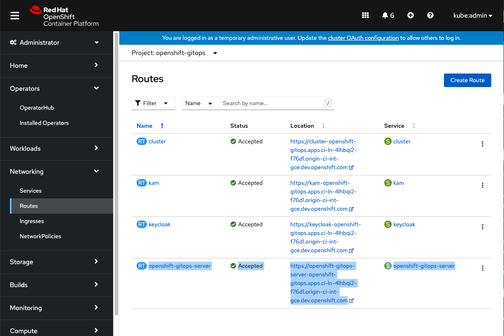
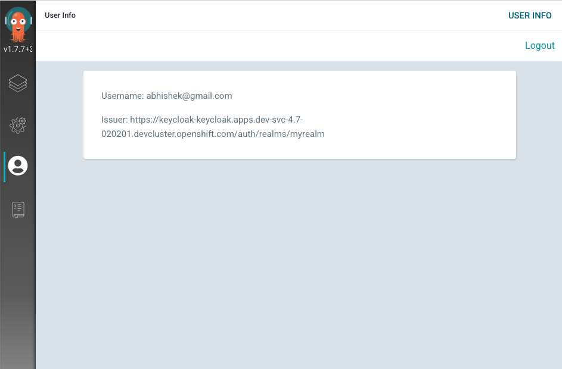

# RHSSO / Keycloak Config Guidance

The scope of this document is to describe the steps to Install, Configure(**Setup Login with OpenShift**) and Uninstall the RHSSO/Keycloak with OpenShift GitOps Operator.

## Table of Contents

1. [Install](#install)
2. [Login with OpenShift](#login-with-openshift)
3. [Argo CD RBAC Policies for RHSSO](#argo-cd-rbac-policies-for-rhsso)
4. [RHSSO Resource requests/limits](#rhsso-resource-requestslimits)
5. [Access RHSSO Admin console](#access-rhsso-admin-console)
6. [Use OpenShift login page as default](#use-openshift-login-page-as-default)
7. [Limitations](#limitations)
8. [Uninstall](#uninstall)

## Install

> **Note**  
`.spec.sso.image`, `.spec.sso.version`, `.spec.sso.resources` and `.spec.sso.verifyTLS` fields in ArgoCD CR are no longer supported in OpenShift GitOps v1.10 onwards. RHSSO/Keycloak can be configured using `.spec.sso.keycloak`. 

1. Disable dex 

    Ensure that dex is disabled by removing `dex` configurations from `.spec.sso` in ArgoCD CR as only one sso provider can be used at any given time. 

    ```bash
    oc -n <namespace> patch argocd <argocd-instance-name> --type='json' -p='[{"op": "remove", "path": "/spec/sso"}]'
    ```

    > **Note**  
    `DISABLE_DEX` environment variable is no longer supported in OpenShift GitOps v1.10 onwards. Dex can be enabled/disabled using `.spec.sso.provider` in ArgoCD CR. 

2. Enable keycloak

    Configure keycloak by performing one of the following steps

    - For a secure connection, set the value of the `rootCA` parameter as shown in the following example 

      ```yaml
      apiVersion: argoproj.io/v1beta1
      kind: ArgoCD
      metadata:
        name: <argocd-instance-name> 
      spec:
        sso:
          provider: keycloak
          keycloak:
            rootCA: <PEM-encoded-root-certificate> 
      ```

      The Operator reconciles changes in the `.spec.sso.keycloak.rootCA` parameter and updates the `oidc.config` parameter with the PEM encoded root certificate in the `argocd-cm` configuration map.

    - For an insecure connection, leave the value of the `rootCA` parameter empty and use the `oidc.tls.insecure.skip.verify` parameter as shown below

      ```yaml
      apiVersion: argoproj.io/v1beta1
      kind: ArgoCD
      metadata:
        name: <argocd-instance-name> 
      spec:
        extraConfig:
          oidc.tls.insecure.skip.verify: "true"
        sso:
          provider: keycloak
          keycloak:
            rootCA: ""
      ```

    Addition configurations such as a different keycloak image, version, resource limits, etc can be provided. Refer [keycloak-options](https://argocd-operator.readthedocs.io/en/latest/reference/argocd/#keycloak-options) section in argocd-operator documentation for more details. 

3. Ensure keycloak sso is configured properly

    > **Note**  
    It usually takes 2-3 minutes for keycloak pods to come up.

    For gitops-operator v1.10 & above, wait for `.status.sso` field of ArgoCD CR to be in `Running` state.
    
    ```bash
    oc -n <namespace> get argocd <argocd-instance-name> -o jsonpath='{.status}'
    ```

    For older versions, check the keycloak sso status by ensuring available replica count of `keycloak` deployment config is `1`.

    ```bash
    oc -n <namespace> get dc keycloak -o jsonpath='{.status.availableReplicas}' 
    ```

4. Restart argocd-server deployment

    Due to a known [issue](https://github.com/argoproj/argo-cd/issues/14038) in ArgoCD, `argocd-server` deployment needs restart every time the SSO provider is switched. Execute the following command to restart the server.

    ```bash
    oc -n <namespace> rollout restart deployment <argocd-instance-name>-server
    ```

    Wait for argocd server deployment to restart successfully.

#### Additional Steps for Disconnected OpenShift Clusters

> **Important**  
Skip this step for regular OCP and OSD clusters.

In a [disconnected](https://access.redhat.com/documentation/en-us/red_hat_openshift_container_storage/4.7/html/planning_your_deployment/disconnected-environment_rhocs) cluster, Keycloak communicates with OpenShift Oauth Server through proxy. Below are some additional steps that need to be followed to get Keycloak integrated with OpenShift Oauth Login.

1. Run the below commands to get values of OAuth & Proxy Server

    Get OAuth Server Host

    ```bash
    oc get routes oauth-openshift -n openshift-authentication -o jsonpath='{.spec.host}'
    ```

    Get Proxy Server Host and port

    ```bash
    oc get proxy cluster -o jsonpath='{.spec.httpProxy}'
    ```

2. Exec into the Keycloak Pod

    ```bash
    oc exec -it dc/keycloak -n <namespace> -- /bin/bash
    ```

3. Run JBoss Cli command

    ```bash
    /opt/eap/bin/jboss-cli.sh
    ```

4. Start an Embedded Standalone Server

    ```bash
    embed-server --server-config=standalone-openshift.xml
    ```

5. Setup Proxy Mappings

    Replace the `<oauth-server-host>` and `<proxy-server-host>` with server values from above step 1.

    ```bash
    /subsystem=keycloak-server/spi=connectionsHttpClient/provider=default:write-attribute(name=properties.proxy-mappings,value=["<oauth-server-host>;<proxy-server-host>"])
    ```


6. Stop the Embedded Server

    ```bash
    quit
    ```

7. Reload JBoss

    ```bash
    /opt/eap/bin/jboss-cli.sh --connect --command=:reload
    ```

8. Exit oc remote shell to keycloak pod

    ```bash
    exit
    ```

## Login with OpenShift

Go to the `OpenShift Console -> Networking -> Routes`.

Select your Argo CD instance namespace under `Project` dropdown.

Click on the `<argocd-instance>-server` route url to access the Argo CD UI.



You will be redirected to Argo CD Login Page.

You can see an option to **LOG IN VIA KEYCLOAK** apart from the usual Argo CD login. Click on the button. (Please clear the site cache or use incognito window if facing issues).


You will be redirected to a new page which provides you an option to **Login with OpenShift**. Click on the button to get redirected to the OpenShift Login Page.


Provide the OpenShift login credentials to get redirected to Argo CD. You can look at the user details by clicking on the User Information Tab as shown below.



## Argo CD RBAC Policies for RHSSO

#### Default access

For versions upto and not including v1.10, 

- any user (except `kube:admin`) logged into Argo CD using RHSSO will be a **read-only** user by default.

  `policy.default: role:readonly`

For versions starting v1.10 and above,

- any user (except `kube:admin`) logged into the default Argo CD instance `openshift-gitops` in namespace `openshift-gitops` will have **no access** by default.

  `policy.default: ''`

- any user logged into user managed custom Argo CD instance will have **read-only** access by default.

  `policy.default: 'role:readonly'`


This default behavior can be modified by updating the `.spec.rbac.defaultyPolicy` in ArgoCD CR.

```yaml
apiVersion: argoproj.io/v1beta1
kind: ArgoCD
metadata:
  name: <argocd-instance-name>
spec:
  rbac:
    defaultyPolicy: 'role:readonly'
```

A detailed information on basic role policies can be found [here](https://argo-cd.readthedocs.io/en/stable/operator-manual/rbac/#basic-built-in-roles).

#### Group Level Access

RHSSO reads the group information of OpenShift users. This allows admin to configure rbac at group level using group name. `.spec.rbac.policy` in ArgoCD CR can be used to add group level rbac policies. 

For example, below will give admin level access to all the users from `foo-admins` OpenShift group.

```yaml
apiVersion: argoproj.io/v1beta1
kind: ArgoCD
metadata:
  name: <argocd-instance-name>
spec:
  rbac:
    policy.csv: |
      g, foo-admins, role:admin
```

More information regarding Argo CD RBAC can be found [here](https://argo-cd.readthedocs.io/en/stable/operator-manual/rbac/).

#### User Level Access

Admin can control access at individual user level by adding rbac configurations under `.spec.rbac.policy` in ArgoCD CR.

For example, below will give admin level access to user with email `foo@example.com`.

```yaml
apiVersion: argoproj.io/v1beta1
kind: ArgoCD
metadata:
  name: <argocd-instance-name>
spec:
  rbac:
    policy.csv: |
      g, foo@example.com, role:admin
```

> **Note**  
RHSSO considers email id as identifier, therefore RBAC configurations need to use email id and not username. You can find email ids for users by logging into RHSSO admin console. Refer [Access RHSSO Admin console](#access-rhsso-admin-console) section for details.

More information regarding Argo CD RBAC can be found [here](https://argo-cd.readthedocs.io/en/stable/operator-manual/rbac/).

## RHSSO Resource requests/limits

RHSSO container by default gets created with following  resource requests and limits.

|Resource|Requests|Limits
|:-:|:-:|:-:|
|CPU|500m|1000m|
|Memory|512 Mi|1024 Mi|

Admin can modify the RHSSO resource requests/limits by updating `.spec.sso.keycloak.resources` field in ArgoCD CR. 

```yaml
apiVersion: argoproj.io/v1beta1
kind: ArgoCD
metadata:
  name: <argocd-instance-name>
spec:
  sso:
    provider: keycloak
    keycloak:
      resources:
        requests:
          cpu: 512m
          memory: 512Mi
        limits:
          cpu: 1024m
          memory: 1024Mi
```

## Access RHSSO Admin console

GitOps Operator creates a RHSSO administrative user which can be used to access the RHSSO console. It's purpose is only for accessing RHSSO admin console and cannot be used to log in into Argo CD.

To access the RHSSO Admin console,  

- Go to the `OpenShift Console -> Networking -> Routes`. 

- Select your Argo CD instance namespace under `Project` dropdown.

- Click on the `keycloak` route url to access the Admin Console UI.


To get the RHSSO administrative user credentials, run below command  
```bash
oc -n <namespace> extract secret/keycloak-secret --to=-
```

> **Note**  
Any configuration changes made via RHSSO admin console will be lost when RHSSO restarts. Refer [Limitations](#limitations) section for more details. 

## Use OpenShift login page as default

It is possible to automatically redirect to an identity provider instead of displaying the RHSSO/Keycloak login form. 

To enable this,
- Login into RHSSO administration console. Refer [Access RHSSO Admin console](#access-rhsso-admin-console) section for steps.

- Go to the `Authentication` page 

- Under `Flows`, select `Browser` in dropdown

- Click on `Actions->Config` in `Identity Provider Redirector` row. 

- Set `Alias` & `Default Identity Provider` values to `openshift-v4`.

If the configured default identity provider is not found the login form will be displayed instead.

## Limitations

The main purpose of RHSSO created by the operator is to allow users to login into Argo CD with their OpenShift users. It is not expected and not supported to update and use this RHSSO instance for any other use-cases. Any additional configuration including users created by the Admin in RHSSO console will be deleted upon RHSSO restarts. 

Additionally, the keycloak administrative user created by operator cannot be used to log in into Argo CD.

## Uninstall

You can delete RHSSO and its relevant configuration by removing the `.spec.sso` field from ArgoCD CR.

```bash
oc -n <namespace> patch argocd <argocd-instance-name> --type json   -p='[{"op": "remove", "path": "/spec/sso"}]'
```

Or 

```yaml
apiVersion: argoproj.io/v1beta1
kind: ArgoCD
metadata:
  name: <argocd-instance-name>
spec:
  sso: {}
```


